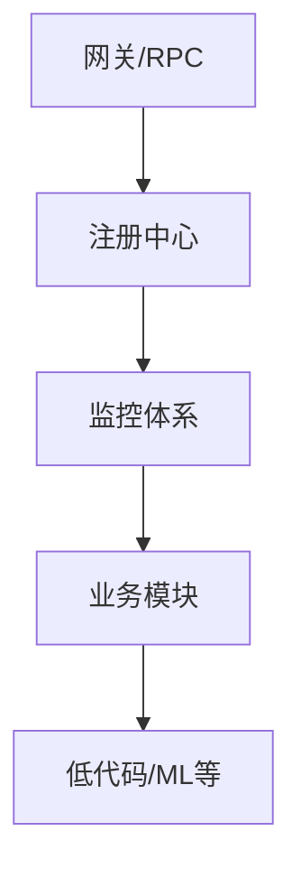

## DeepSeek回答

### **第一阶段：基础架构认知（1-2周）​**

1. ​**微服务核心组件**
    - 先学习`dip-gateway-release`（API网关）和`dip-rpc-release`（RPC框架），这是微服务的流量入口和通信基础
    - 结合Spring Cloud Gateway/OpenFeign对比学习
2. ​**服务注册与配置中心**
    - 研究`dip-nacos-release`（阿里Nacos），掌握服务注册发现和配置管理
    - 实践与Spring Cloud Alibaba整合

---

### ​**第二阶段：关键中间件（2-3周）​**

1. ​**监控体系**
    - 学习`kube-prometheus-release`（Prometheus监控）和`cat-release`（美团监控）
    - 搭建监控看板，理解指标采集和告警规则
2. ​**时序数据库**
    - 研究`dip-iotdb-release`（Apache IoTDB），掌握工业物联网场景的时序数据存储
3. ​**任务调度**
    - 分析`dip-scheduler-release`和`dip-job-release`，对比XXL-JOB等开源方案

---

### ​**第三阶段：业务平台（3-4周）​**

1. ​**低代码平台**
    - 重点学习`dip-lcdp-release`（Low-Code Development Platform）
    - 研究动态表单、流程引擎等实现原理
2. ​**用户体系**
    - 分析`dip-user-release`和权限控制模块
3. ​**前端工程**
    - 了解`dip-init-web-release`（Vue/React）和`dip-mgmt-fe-fat`的关系

---

### ​**第四阶段：专项深入（可选）​**

1. ​**机器学习**
    - 研究`dip-mlengine-release`的模型部署架构
2. ​**大数据集成**
    - 分析`dip-iotdb-release`与`kibana3-release`的数据可视化链路
3. ​**云原生部署**
    - 学习`dip-maven-release`的制品管理和K8s部署规范

---

### ​**学习技巧**

1. ​**逆向工程法**：
    - 用JD-GUI反编译`*-release.jar`，结合配置文件分析模块职责
2. ​**环境搭建**：
    - 优先搭建`dip-nacos`+`dip-gateway`+`dip-user`的最小验证环境
3. ​**文档挖掘**：
    - 查找内部Wiki的架构图，重点关注模块间的依赖关系

---

### ​**优先级推荐**

## Grok回答

### 学习目标

1. **理解整体架构**：这是一个微服务系统，包含网关、服务注册、调度、用户管理等模块。
2. **掌握核心模块**：从后端开发者的角度，先聚焦Java相关模块，再扩展到其他功能。
3. **逐步扩展**：从熟悉的领域（Spring微服务）入手，逐步接触新领域（如IoT、低代码平台）。

---

### 学习路径建议

#### 第一阶段：熟悉微服务基础模块

这些模块是你已经熟悉的Spring和微服务领域的延伸，建议先从这里入手，建立信心并理解项目的核心架构。

1. **dip-init-java-release.zip**
    - **简介**：这是Java后端初始模块，可能是整个系统的核心后端服务，基于Spring Boot或Spring Cloud。
    - **建议**：从这里开始，解压项目，查看pom.xml（Maven依赖），熟悉技术栈（Spring Boot、Spring Cloud、MyBatis/JPA等）。运行项目，看看有哪些接口和服务。
    - **学习重点**：微服务的基础配置（如Spring Cloud Config、Eureka/Consul注册中心）。
2. **dip-gateway-release.zip**
    - **简介**：网关模块，可能是基于Spring Cloud Gateway或Zuul，负责请求路由、负载均衡、权限校验等。
    - **建议**：研究网关的配置文件（如application.yml），理解路由规则、过滤器、限流等功能。
    - **学习重点**：网关在微服务中的作用，动态路由配置。
3. **dip-nacos-release.zip**
    - **简介**：Nacos是服务注册与配置中心，类似Spring Cloud的Eureka+Config。
    - **建议**：学习Nacos的基本使用，搭建一个本地Nacos服务，尝试注册一个简单的Spring Boot服务。
    - **学习重点**：服务发现、配置管理。

#### 第二阶段：深入核心业务模块

这些模块涉及具体业务逻辑，适合在熟悉基础架构后再深入。

4. **dip-user-release.zip & dip-user-job-release.zip**
    - **简介**：用户管理模块和相关定时任务模块，可能包含用户认证、权限管理（RBAC）等功能。
    - **建议**：查看数据库设计（如果有SQL脚本）和接口定义，理解用户体系如何与网关、RPC模块协作。
    - **学习重点**：Spring Security/JWT认证，定时任务（Spring Schedule或Quartz）。
5. **dip-rpc-release.zip**
    - **简介**：RPC（远程过程调用）模块，可能基于Dubbo、gRPC或Feign，用于服务间通信。
    - **建议**：研究服务的接口定义和调用方式，尝试写一个简单的RPC客户端和服务端。
    - **学习重点**：微服务通信机制，序列化协议（如Protobuf）。
6. **dip-scheduler-release.zip**
    - **简介**：调度模块，可能基于分布式任务调度框架（如XXL-Job、ElasticJob）。
    - **建议**：学习调度框架的基本原理，运行项目，看看任务是如何分配和执行的。
    - **学习重点**：分布式任务调度的实现。

#### 第三阶段：扩展到高级功能模块

这些模块可能涉及新领域（如IoT、低代码），可以根据兴趣选择性学习。

7. **dip-iotdb-release.zip**
    - **简介**：物联网数据库模块，可能基于Apache IoTDB，用于存储和查询时序数据。
    - **建议**：先学习IoTDB的基本概念（时序数据库 vs 关系数据库），然后结合项目代码理解数据流。
    - **学习重点**：时序数据的处理和应用场景。
8. **dip-lcdp-release.zip**
    - **简介**：低代码开发平台（Low-Code Development Platform），可能是可视化搭建工具的后端。
    - **建议**：研究其API设计和数据模型，尝试理解如何通过配置生成应用。
    - **学习重点**：低代码平台的架构思想。
9. **dip-mlengine-release.zip**
    - **简介**：机器学习引擎模块，可能集成了ML模型的训练或推理功能。
    - **建议**：如果对ML感兴趣，可以先学习基础（如Python+TensorFlow），再结合项目代码。
    - **学习重点**：后端如何与ML模型交互。

#### 第四阶段：前端与周边生态

这些模块涉及前端或运维工具，可以最后学习，了解系统全貌。

10. **dip-mgmt-fat.zip & dip-mgmt-fe-fat.zip**
    - **简介**：管理系统后端和前端，可能是管理后台。
    - **建议**：关注后端接口如何与前端交互，学习基本的Vue/React（如果适用）。
    - **学习重点**：前后端分离开发。
11. **kibana3-release.zip & kube-prometheus-release.zip**
    - **简介**：监控相关模块，Kibana用于日志可视化，kube-prometheus用于Kubernetes集群监控。
    - **建议**：搭建本地Kubernetes环境，部署这些工具，观察系统运行状态。
    - **学习重点**：日志分析、Prometheus监控。

---

### 学习建议与技巧

1. **从熟悉的入手**：先从dip-init-java-release.zip和dip-gateway-release.zip开始，因为它们最贴近你的Spring和微服务经验。
2. **逐个击破**：不要试图一次搞懂所有模块，挑一个解压、运行、调试，搞清楚后再换下一个。
3. **查看文档**：如果项目有README.md或docs目录，优先阅读，可能会节省大量时间。
4. **搭建环境**：准备好本地开发环境（Maven、Docker、MySQL、Redis等），尝试运行项目。
5. **记录笔记**：每个模块学完后，记下关键点（如技术栈、功能），方便回顾。
6. **提问补充**：如果某个模块看不懂，可以告诉我具体文件名或代码片段，我再帮你分析。

---

### 项目简介概览

这个项目是一个典型的微服务架构系统，包含以下特点：

- **技术栈**：Spring Cloud（网关、RPC、Nacos）、任务调度（Scheduler）、时序数据库（IoTDB）、低代码平台（LCDP）。
- **模块分工**：网关（Gateway）负责流量入口，Nacos负责服务治理，用户模块（User）处理认证授权，IoT和ML模块扩展了功能边界。
- **部署方式**：可能是Docker/Kubernetes部署（从kube-prometheus推测）。

## Chat回答

## **学习顺序总结**

1. **先搞清楚基础架构**
    
    - `dip-nacos-release.zip`（服务发现 & 配置）
        
    - `dip-gateway-release.zip`（网关）
        
    - `kibana3-release.zip`（日志分析）
        
    - `kube-prometheus-release.zip`（监控）
        
2. **再研究业务层**
    
    - `dip-mgmt-fat.zip` / `dip-portal-system-release.zip`（管理 & 门户）
        
    - `dip-user-release.zip` / `dip-user-job-release.zip`（用户相关）
        
3. **最后深入进阶方向**
    
    - `dip-iotdb-release.zip`（数据库）
        
    - `dip-scheduler-release.zip`（任务调度）
        
    - `dip-mlengine-release.zip`（机器学习）