## 参考

Ob 的中文教程（大概是目前最全最新的）：[- Obsidian Publish](https://link.zhihu.com/?target=https%3A//publish.obsidian.md/chinesehelp/)

[Obsidian (黑曜石)筆記軟體的基本操作指引](https://link.zhihu.com/?target=http%3A//jdev.tw/blog/6319/obsidian-users-guide)

打开后台: ctrl + shift + I

## 1.MarkDown 语法

使用 Ob 写笔记的基本语法，和一些快捷键。有些是 Ob 的特定格式。
【说明】粗体显示文本表示 Ob 中的有效输入字符。

### 1. 标题

共可分 6 级。
1 级标题：#+ 空格 + 标题
2 级标题：##+ 空格 + 标题
3 级标题：###+ 空格 + 标题
4 级标题：####+ 空格 + 标题
5 级标题：#####+ 空格 + 标题
6 级标题：######+ 空格 + 标题

### 2. 分割线

连续输入≥3 个的 - 或 ***

### 3. 列表

- 无序列表：文本开头使用 `- 或者 * `
- 有序列表：文本开头使用 `数字+.+空格`

### 4. 插入外部链接

- 以地址方式显示：直接粘贴
- 以描述显示：`[描述](链接地址)` 快捷键 Ctrl+K
- 本地文件: `[阅读速度记录Excel](file://C:/Users/Administrator/iCloudDrive/iCloud~md~obsidian/TechNotes/附件/OtherFile/ReadingSpeed.xlsx)` ^a76f6f
	- 插入本地链接

### 5. 块引用

段落开头使用 `>`

### 6. 代码块

- 整段代码：段落开头输入一个制表符 (Tab)
- 段落文本中的代码：·代码内容· (单引号，键盘 Esc 键下面那个，这里显示的是一个点)
- 代码块：连用三个 · (代码块中会使用语法高亮显示)

【注】在使用代码块时，在三个单引号后面输入指定的语言，来选择语法高亮显示的方式。Ob 支持的语言和相应代号可以在这里找到：[supported-languages](https://link.zhihu.com/?target=https%3A//prismjs.com/%23supported-languages)。

### 7. 文字样式

斜体：*斜体内容* 快捷键 Ctrl+I
粗体：**粗体内容** 快捷键 Ctrl+B
斜 + 粗：***斜粗内容***
删除线：~~删除内容~~
高亮文本：==高亮内容==

【注】在这里 * 与 _ 是通用的

### 8. 插入图片与音频

- 网络附件：``
- 本地附件：`![[带后缀文件名]] 或者直接从本地拖入`

【注 1】在 Ob 中拖入的本地图片与音频会以附件的重新复制到库中，建议先在库中新建一个文件夹，然后右键选择将其作为附件文件夹，这样所有新添加的附件就都会保存到该文件夹中，方便管理。

【注 2】直接使用 `![[带后缀文件名]]` 语句时，附件需已存放在附件文件夹中。

 - 用以下语法来调整引用的图片或 Excalidraw 的大小 `![[理想冰箱 | 200]]`, ``

### 9. 标签

首先在插件中打开标签管理插件，
然后在笔记中使用 `#+标签文本` 添加标签。

### 10. 任务列表 复选框

- 已完成：`- [x]+空格+内容`
- 未完成：`- []+空格+内容`

示例:
- [ ] 任务 1
- [x] 任务 2

【注】在预览界面中可以直接单击复选框来改变其状态。

### 11. 绘制表格

（偷一张图）链接：https://zhuanlan.zhihu.com/p/24575242

- 用符号 | 作为列分割。| 和其他字符之间要加空格。
- 表头和表体使用 ---- 进行分割，其中 - 的数量应≥3。
- 在分割栏横线中使用: 设置该列文本对齐方式，不加为居左，头尾加为居中，尾加为右。
- 单元格内换行可用<br/>。
- 每一行的列数允许少于总列数。

```text
#### 这是一个简单的3x3表格示例：

| 标题0 | 标题1 | 标题2 |
|----|----|----|
| ddd | sss | aaa |
| ccc | xxx | zzz |

（复制过去之后记得按照这个格式排版）
```

### 12. 脚注

- 普通脚注：`[^1]` 然后隔一行输入 `[^2]:` 脚注内容
- 内部脚注：`^[內填脚注内容]`

示例 [^1]

[^1]: 脚注 1 标识的内容

你还可以使用内部脚注^[这是内部脚注的内容]

### 13. 数学公式

参考
1. [符号 (wolai.com)](https://www.wolai.com/wolai/eNQ5KfwZCT4A6VfFsoF31G)
2. [LaTeX数学公式语法 (wolai.com)](https://www.wolai.com/wolai/egjDbHiAfGfJmwR972fcEW)

工具:
1. [Online LaTeX Equation Editor - create, integrate and download (codecogs.com)](https://latex.codecogs.com/legacy/eqneditor/editor.php?tdsourcetag=s_pctim_aiomsg)
2. [在线LaTeX公式编辑器-编辑器 (latexlive.com)](https://www.latexlive.com/home) 直接可以使用

### 14. 内部链接

链接到其它页面 (笔记)：`[[笔记名称]]`
直接在笔记中嵌入其它笔记内容：`! [[笔记名称]]`

【注】当在笔记中直接输入 `[[名称]]` 创建一个内部链接时，若该链接指定的页面不存在，则关系图中会使用一个灰色的节点来表示。单击该节点或者在预览中单击链接，将会直接创建一个新笔记。

### 15. Markdown 空格符号

&emsp; 全角空格

&ensp; 半角空格

&nbsp; 不断行的空格

---

### 16. Callout

#### Supported types 

[自定义Callouts](https://help.obsidian.md/Editing+and+formatting/Callouts#Customize%20callouts)

[Callouts - Obsidian Help](https://help.obsidian.md/Editing+and+formatting/Callouts)

[Lucide_icon](https://lucide.dev/icons/)

> [!note]
> Lorem ipsum dolor sit amet

> [!Abstract]
> Aliases: `summary`, `tldr`

> [!Info]

> [!Todo]
> Aliases: `hint`, `important`

> [!Success]
Aliases: `check`, `done`

> [!Question]
Aliases: `help`, `faq`

> [!Warning]
Aliases: `caution`, `attention`

> [!Failure]
Aliases: `fail`, `missing`

> [!Danger]
Alias: `error`

> [!Bug]

> [!Example]

> [!Quote]
Alias: `cite`

#### Callout 的展开与折叠

```text
> [!NOTE]+ 左边多了个加号
> 代表 Callout 默认展开

> [!NOTE]- 左边多了个减号
> 代表 Callout 默认折叠
```

#### Callout 的嵌套使用

每到下一层多加个一个 `>` 即可，例如

```text
> [!question] Can callouts be nested?
> > [!todo] Yes!, they can.
> > > [!example]  You can even use multiple layers of nesting.
```

### 17.Mermaid

#### 图形


#### 饼状图

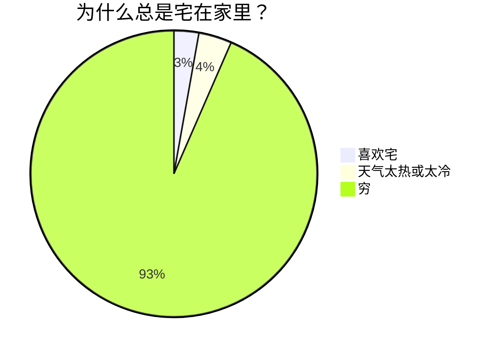

#### 流程图 (Flowchart)

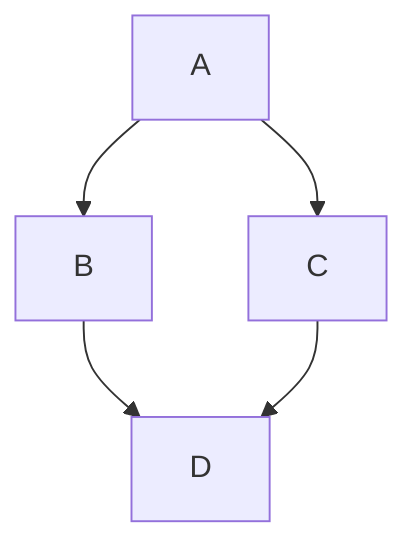

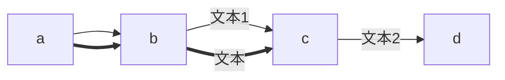

#### State Diagram(状态转移图)

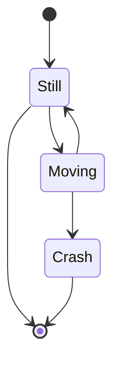

#### Sequence diagram(交互图)

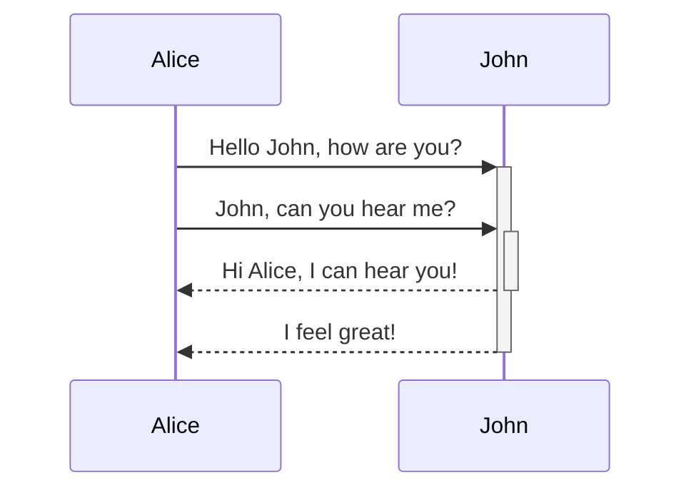

#### Gantt diagram(甘特图)

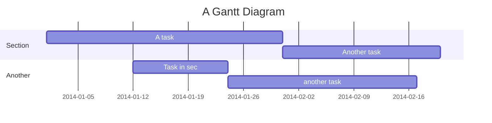

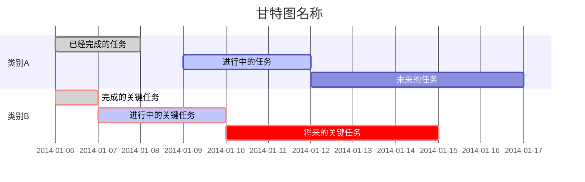

#### Class diagram(类继承)

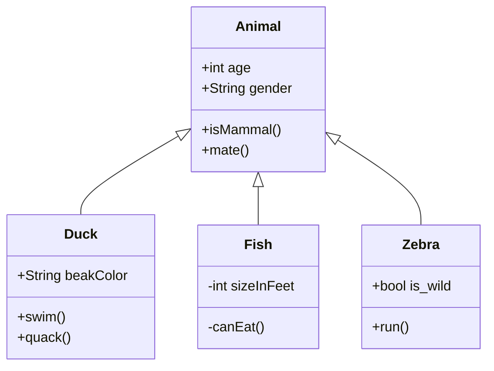

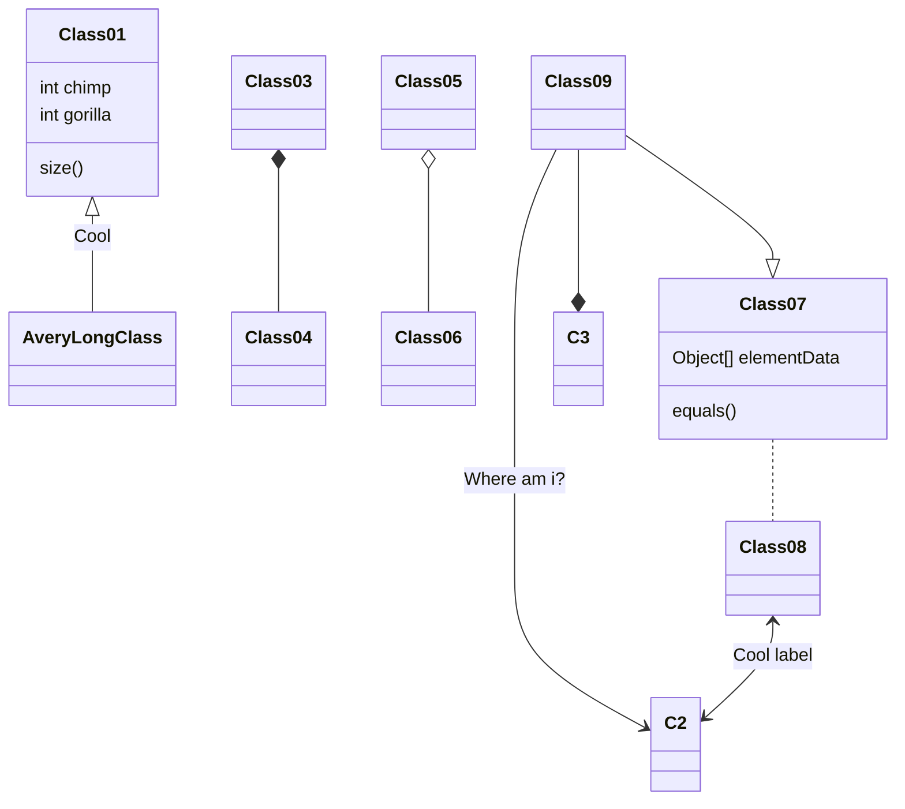

#### Gitgraph(项目 fork 图)


#### Entity Relationship Diagram(实体关系图)

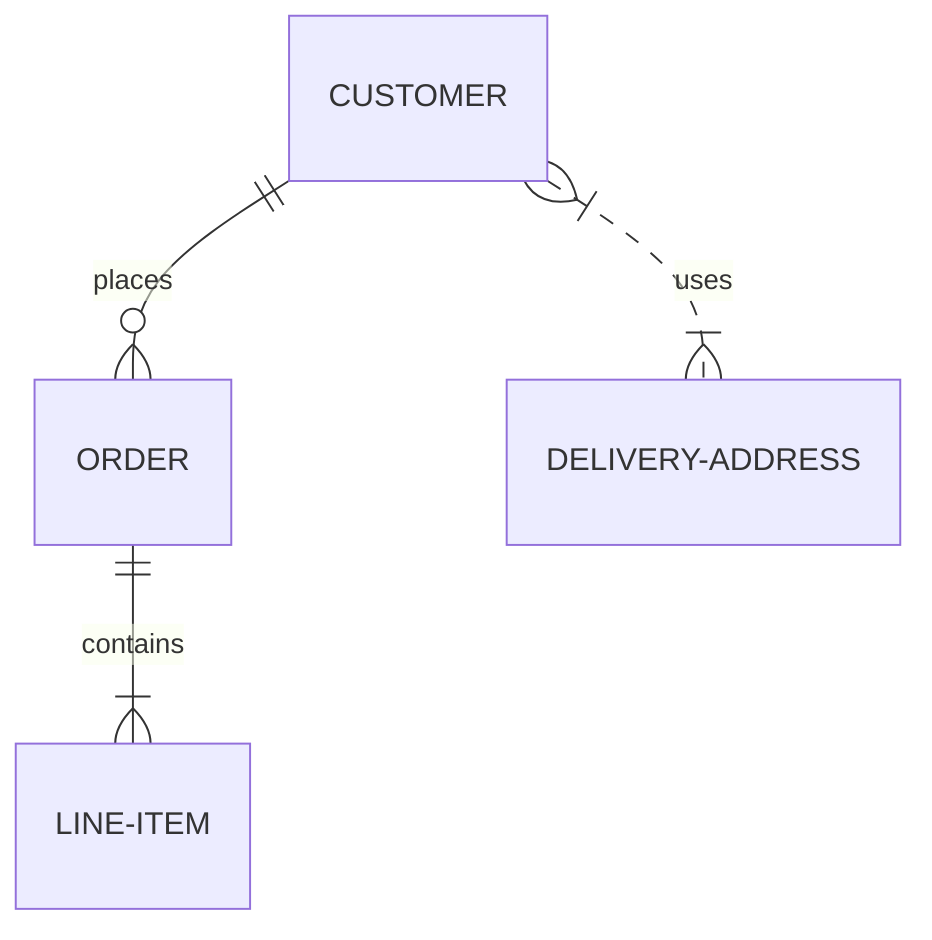

#### User Journey Diagram(日常图)

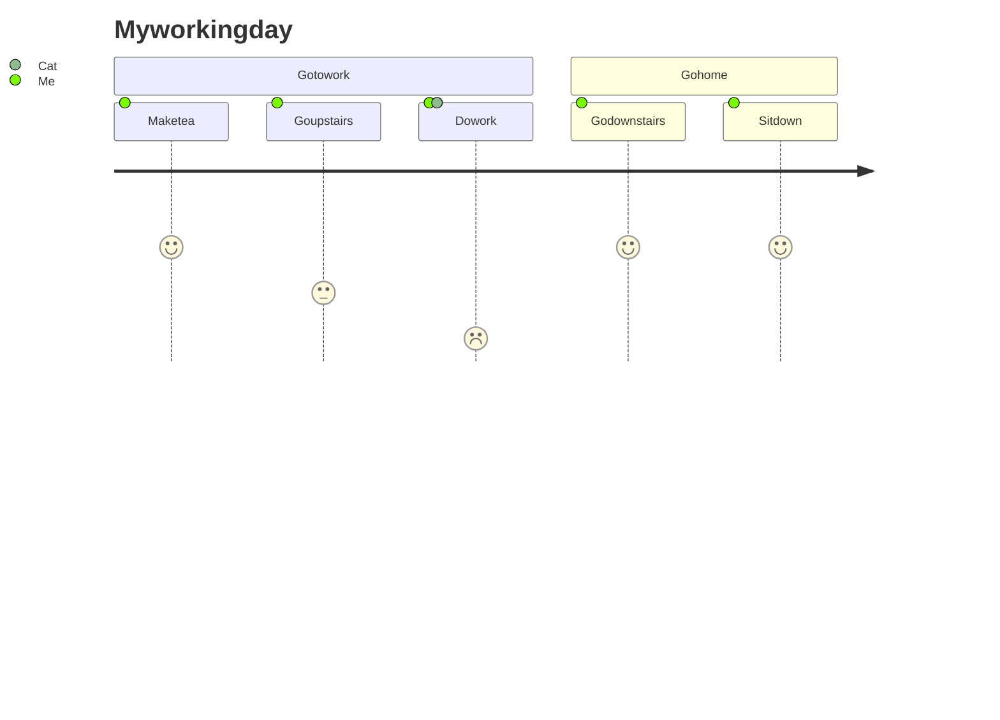

## 2.插件使用

### text-snippets

- 命令为 run text-snippets(在 ctrl + p 中), 当前设置的快捷键是 shift + tab

### dataview 目录文档格式

	```dataview
	table author,categories,date,tags
	from "03_笔记-阅读"
	sort categories asc
	```

	```dataview 
	table 
	from "📘归档记录_阅读_分享_摘抄" 
	where star = true
	sort filename desc 
	```

![[附件/image/DataView-1678152719037.jpeg]]

## 3.Obsidian 常用 CSS

### 常用样式

```css
ol ol {

 list-style-type: lower-latin;

}

ol ol ol {

 list-style-type: lower-roman;

}

无序:

li li{

 list-style-type:square;

}

li li li{

 list-style-type:circle;

}
```

### 换背景图

1. 图片压缩到合适大小
2. 切换成 base64 编码: [切换地址](https://tools.whsir.com/dataurl/)
3. 填入单引号中

```css
body {
    background-image: url('base64') ;
    background-size: cover;
    opacity: 0.91; // 透明度
}
```

1. `/* Comment */` 为 css 的注释格式

## 其它

进入控制台 ctrl + shift + I
