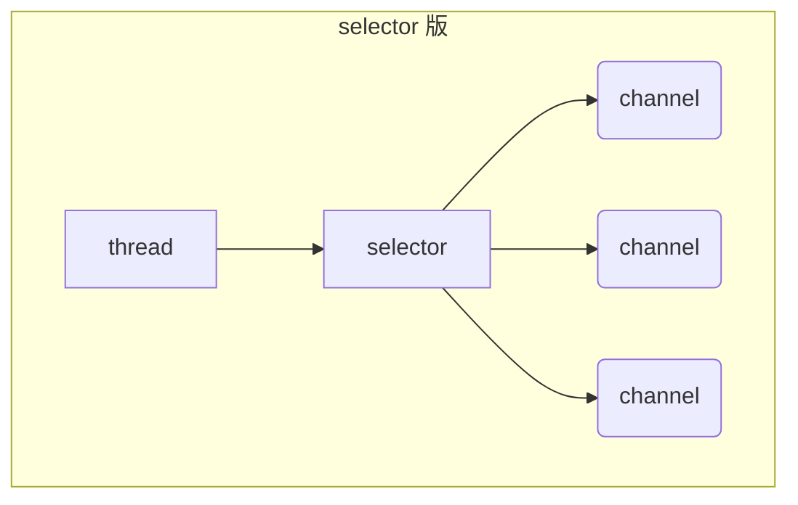
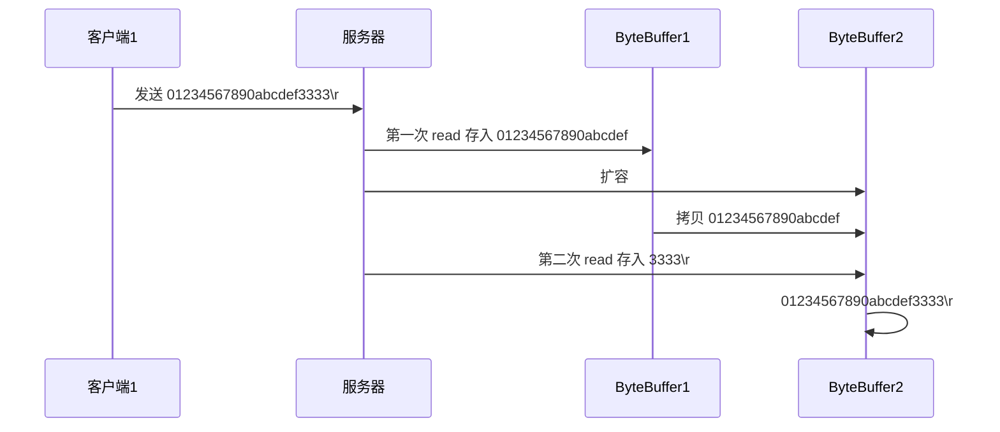

# 一. 基本概念

## 1.1 BIO, NIO, AIO 介绍

### 介绍

#### Java BIO

- Blocking IO

阻塞 IO(BIO) 是最传统的一种 IO 模型, 即在读写数据过程中会发生阻塞现象, 直至有可供读取的数据或者数据能够写入.

(1) 在 BIO 模式中, 服务器会为每个客户端请求建立一个线程, 由该线程单独负责处理一个客户请求, 这种模式虽然简单方便, 但由于服务器为每个客户端的连接都采用一个线程去处理, 使得资源占用非常大. 因此, 当连接数量达到上限时, 如果再有用户请求连接, 直接会导致资源瓶颈, 严重的可能会直接导致服务器崩溃.

(2) 大多数情况下为了避免上述问题, 都采用了线程池模型. 也就是创建一个固定大小的线程池, 如果有客户端请求, 就从线程池中取一个空闲线程来处理, 当客户端处理完操作之后, 就会释放对线程的占用. 因此这样就避免为每一个客户端都要创建线程带来的资源浪费, 使得线程可以重用. 但线程池也有它的弊端, 如果连接大多是长连接, 可能会导致在一段时间内, 线程池中的线程都被占用, 那么当再有客户端请求连接时, 由于没有空闲线程来处理, 就会导致客户端连接失败.

#### Java NIO

- No-Blocking IO

基于 BIO 的各种弊端, 在 JDK1.4 开始出现了高性能 IO 设计模式非阻塞 IO(NIO).

(1) NIO 采用非阻塞模式, 基于 Reactor 模式的工作方式, I/O 调用不会被阻塞, 它的实现过程是: 会先对每个客户端注册感兴趣的事件, 然后有一个线程专门去轮询每个客户端是否有事件发生, 当有事件发生时, 便顺序处理每个事件, 当所有事件处理完之后, 便再转去继续轮询. 如下图所示:

![[附件/image/01_NIO 知识 (BIO_NIO_AIO)-23.jpg]]

(2) NIO 中实现非阻塞 I/O 的核心对象就是 Selector, Selector 就是注册各种 I/O 事件地方, 而且当我们感兴趣的事件发生时, 就是这个对象告诉我们所发生的事件, 如下图所示:

![[附件/image/01_NIO 知识 (BIO_NIO_AIO).jpg]]

(3) NIO 的最重要的地方是当一个连接创建后, 不需要对应一个线程, 这个连接会被注册到多路复用器上面, 一个选择器线程可以同时处理成千上万个连接, 系统不必创建大量的线程, 也不必维护这些线程, 从而大大减小了系统的开销.

#### Java AIO

- Async IO

(1)AIO 也就是 NIO 2, 在 Java 7 中引入了 NIO 的改进版 NIO 2, 它是异步非阻塞的 IO 模型. 异步 IO 是基于事件和回调机制实现的, 也就是说 AIO 模式不需要 selector 操作, 而是是事件驱动形式, 也就是当客户端发送数据之后, 会主动通知服务器, 接着服务器再进行读写操作.

(2)Java 的 AIO API 其实就是 Proactor 模式的应用, 和 Reactor 模式类似 Reactor 和 Proactor 模式的主要区别就是真正的读取和写入操作是由谁来完成的, Reactor 中需要应用程序自己读取或者写入数据, 而 Proactor 模式中, 应用程序不需要进行实际的读写过程, 它只需要从缓存区读取或者写入即可, 操作系统会读取缓存区或者写入缓存区到真正的 IO 设备.

### BIO 与 NIO 的比较 (BIO)

- BIO 以流的方式处理数据,而 NIO 以块 (Buffer 和 Channel) 的方式处理数据,块 I/O 的效率比流 I/O 高很多

- BIO 是阻塞的，NIO 则是非阻塞的

- BIO 基于字节流和字符流进行操作，而 NIO 基于 Channel(通道) 和 Buffer(缓冲区) 进行操作，数据总是从通道 读取到缓冲区中，或者从缓冲区写入到通道中。Selector(选择器) 用于监听多个通道的事件（比如：连接请求，数据到达等），因此使用单个线程就可以监听多个客户端通道

![[附件/image/01_NIO 知识 (BIO_NIO_AIO)-24.jpg]]

### Stream(流) 与 Channel 的区别 (黑)

- stream 不会自动缓冲数据，channel 会利用系统提供的发送缓冲区、接收缓冲区（更为底层）

- stream 仅支持阻塞 API，channel 同时支持阻塞、非阻塞 API，网络 channel 可配合 selector 实现多路复用

- 二者均为全双工，即读写可以同时进行

## 1.2 同步, 异步与阻塞的概念分析

同步阻塞、同步非阻塞、同步多路复用、异步阻塞（没有此情况）、异步非阻塞

- 同步：线程自己去获取结果（一个线程）

- 异步：线程自己不去获取结果，而是由其它线程送结果（至少两个线程）

当调用一次 channel.read 或 stream.read 后，会**切换至操作系统内核态来完成真正数据读取**, 简单来说就是从 java 方法, 调用操作系统提供的方法，而读取又分为两个阶段，分别为：

- 等待数据阶段

    数据还没有发到网卡

- 复制数据阶段

	从网卡复制到内存

-25.jpg)

### 同步阻塞

- 阻塞 IO

-26.jpg)

网络上还没有数据真正发送过来, 此时 read 方法被阻塞 (线程停止)

与多路复用相比: 如果 read 之间, 有 accept 事件, 那么新的 read 事件阻塞等待 accept 的发生和完成 (需要依次等待各个事件发生)

### 同步非阻塞

* 非阻塞 IO

read 方法没有读到数据, 于是返回 0(此时可以切换完成其他任务)

### 多路复用

这种情况下 select 阶段是阻塞的, read 阶段也是阻塞的

与阻塞 IO 相比: 如果多个 read 事件之间有 accept 事件, 那么可以一次性完成事件的等待, 再依次处理事件.

- 阻塞:

  -29.jpg)

- 多路复用

  -30.jpg)

### 信号驱动 (不常用)

### 异步阻塞

- 这是一个不存在的概念, 只要是异步的, 就一定是非阻塞的

### 异步非阻塞

- 异步：线程自己不去获取结果，而是由其它线程送结果（至少两个线程）

### ※零拷贝的概念

#### 传统 IO 问题

传统的 IO 将一个文件通过 socket 写出

```java
File f = new File("helloword/data.txt");
RandomAccessFile file = new RandomAccessFile(file, "r");

byte[] buf = new byte[(int)f.length()];
file.read(buf);

Socket socket = ...;
socket.getOutputStream().write(buf);
```

内部工作流程是这样的：

-31.jpg)

1. java 本身并不具备 IO 读写能力，因此 read 方法调用后，要从 java 程序的**用户态**切换至**内核态**(第 1 次状态切换)，去调用操作系统（Kernel）的读能力，将数据读入操作系统的**内核缓冲区**。这期间用户线程阻塞，操作系统使用 DMA（Direct Memory Access）来实现文件读，其间也不会使用 cpu

   > DMA 也可以理解为硬件单元，用来解放 cpu 完成文件 IO

2. 从**内核态**切换回**用户态**(第 2 次状态切换)，将数据从**内核缓冲区**读入**用户缓冲区**（即 byte[] buf），这期间 cpu 会参与拷贝，无法利用 DMA

3. 调用 write 方法，这时将数据从**用户缓冲区**（byte[] buf）写入 内核**socket 缓冲区**，cpu 会参与拷贝

4. 接下来要向网卡写数据，这项能力 java 又不具备，因此又得从**用户态**切换至**内核态**，调用操作系统的写能力，使用 DMA 将 **socket 缓冲区**的数据写入网卡，不会使用 cpu

可以看到中间环节较多，java 的 IO 实际不是物理设备级别的读写，而是缓存的复制，底层的真正读写是操作系统来完成的

* 用户态与内核态的切换发生了 3 次，这个操作比较重量级
	* 第一次: read, java->操作系统
	* 第二次: read 结束, 操作系统 ->java
	* 第三次: write, java-> 操作系统
* 数据拷贝了共 4 次

#### NIO 优化

通过 DirectByteBuf

* ByteBuffer.allocate(10) HeapByteBuffer 使用的还是 java 内存
* ByteBuffer.allocateDirect(10) DirectByteBuffer 使用的是操作系统内存

-32.jpg)

大部分步骤与优化前相同，不再赘述。唯有一点：java 可以使用 DirectByteBuf 将堆外内存映射到 jvm 内存中来直接访问使用

* 减少了一次数据拷贝，用户态与内核态的切换次数没有减少 (Java -> 内核 -> Java -> 内核)
* 这块内存不受 jvm 垃圾回收的影响，因此内存地址固定，有助于 IO 读写
* java 中的 DirectByteBuf 对象仅维护了此内存的虚引用，内存回收分成两步
  * DirectByteBuf 对象被垃圾回收，将虚引用加入引用队列
  * 通过专门线程访问引用队列，根据虚引用释放堆外内存

进一步优化（底层采用了 linux 2.1 后提供的 sendFile 方法），java 中对应着两个 channel 调用 transferTo/transferFrom 方法拷贝数据 (FileChannel 中才有, SocketChannel 中没有)

-33.jpg)

1. java 调用 transferTo 方法后，要从 java 程序的**用户态**切换至**内核态**，使用 DMA 将数据读入**内核缓冲区**，不会使用 cpu
2. 数据从**内核缓冲区**传输到 **socket 缓冲区**，cpu 会参与拷贝
3. 最后使用 DMA 将 **socket 缓冲区**的数据写入网卡，不会使用 cpu

可以看到

* 只发生了一次用户态与内核态的切换 ( java->操作系统 )
* 数据拷贝了 3 次

进一步优化（linux 2.4）

-34.jpg)

1. java 调用 transferTo 方法后，要从 java 程序的**用户态**切换至**内核态**，使用 DMA 将数据读入**内核缓冲区**，不会使用 cpu
2. 只会将一些 offset 和 length 信息拷入 **socket 缓冲区**，几乎无消耗
3. 使用 DMA 将 **内核缓冲区**的数据写入网卡，不会使用 cpu

整个过程仅只发生了一次用户态与内核态的切换，数据拷贝了 2 次。所谓的【零拷贝】，并不是真正无拷贝，而是在不会拷贝重复数据到 jvm 内存中，零拷贝的优点有

* 更少的用户态与内核态的切换
* 不利用 cpu 计算，减少 cpu 缓存伪共享
* 零拷贝适合小文件传输 (缓冲区需要反复获取数据, 没有充分发挥缓冲的效果, 影响其他操作)

区分于 netty 的零拷贝概念 (netty 中用 slice 来减少 bytebuf 内存的拷贝)

# 二. 传统 BIO 编程回顾

## 2.1 Java BIO 基本介绍

* Java BIO 就是传统的 java io 编程，其相关的类和接口在 java.io
* BIO(blocking I/O) ： 同步阻塞，服务器实现模式为一个连接一个线程，即客户端有连接请求时服务器端就需
  要启动一个线程进行处理，如果这个连接不做任何事情会造成不必要的线程开销，可以通过线程池机制改善 (实现多个客户连接服务器).

## 2.2 Java BIO 工作机制

![[附件/image/01_NIO 知识 (BIO_NIO_AIO)-35.jpg]]

对 BIO 编程流程的梳理
1. 服务器端启动一个 **ServerSocket**，注册端口，调用 accpet 方法监听客户端的 Socket 连接。
2. 客户端启动 **Socket** 对服务器进行通信，默认情况下服务器端需要对每个客户 建立一个线程与之通讯

## 2.3 传统的 BIO 编程实例回顾

​	网络编程的基本模型是 Client/Server 模型，也就是两个进程之间进行相互通信，其中服务端提供位置信（绑定 IP 地址和端口），客户端通过连接操作向服务端监听的端口地址发起连接请求，基于 TCP 协议下进行三次握手连接，连接成功后，双方通过网络套接字（Socket）进行通信。

​	传统的同步阻塞模型开发中，服务端 ServerSocket 负责绑定 IP 地址，启动监听端口；客户端 Socket 负责发起连接操作。连接成功后，双方通过输入和输出流进行同步阻塞式通信。
​	基于 BIO 模式下的通信，客户端 - 服务端是完全同步，完全耦合的。

### 		客户端案例如下

[[08_IO流]]

```java
/**
    目标: Socket网络编程。

    Java提供了一个包：java.net下的类都是用于网络通信。
    Java提供了基于套接字（端口）Socket的网络通信模式，我们基于这种模式就可以直接实现TCP通信。
    只要用Socket通信，那么就是基于TCP可靠传输通信。

    功能1：客户端发送一个消息，服务端接口一个消息，通信结束！！

    创建客户端对象：
        （1）创建一个Socket的通信管道，请求与服务端的端口连接。
        （2）从Socket管道中得到一个字节输出流。
        （3）把字节流改装成自己需要的流进行数据的发送
    创建服务端对象：
        （1）注册端口
        （2）开始等待接收客户端的连接,得到一个端到端的Socket管道
        （3）从Socket管道中得到一个字节输入流。
        （4）把字节输入流包装成自己需要的流进行数据的读取。

    Socket的使用：
        构造器：pu991的，对方怎么发你就怎么收，对方发多少你就只能收多少！！

 */
public class ClientDemo {
    public static void main(String[] args) throws Exception {
        System.out.println("==客户端的启动==");
        // （1）创建一个Socket的通信管道，请求与服务端的端口连接。
        Socket socket = new Socket("127.0.0.1",8888);
        // （2）从Socket通信管道中得到一个字节输出流。
        OutputStream os = socket.getOutputStream();
        // （3）把字节流改装成自己需要的流进行数据的发送
        PrintStream ps = new PrintStream(os);
        // （4）开始发送消息,注意, print时, 不能正常发送
		//ps.print("我是客户端");
        ps.println("我是客户端，我想约你吃小龙虾！！！");
        ps.flush();
    }
}
```

### 服务端案例如下

```java
/**
 * 服务端
 */
public class ServerDemo {
    public static void main(String[] args) throws Exception {
        System.out.println("==服务器的启动==");
        // （1）注册端口
        ServerSocket serverSocket = new ServerSocket(8888);
        //（2）开始在这里暂停等待接收客户端的连接,得到一个端到端的Socket管道
        Socket socket = serverSocket.accept();
        //（3）从Socket管道中得到一个字节输入流。
        InputStream is = socket.getInputStream();
        //（4）把字节输入流包装成自己需要的流进行数据的读取。
        BufferedReader br = new BufferedReader(new InputStreamReader(is));
        //（5）读取数据
        String line ;
		//换成if, 则只接受一行, 不会报错
        while((line = br.readLine())!=null){
            System.out.println("服务端收到："+line);
        }
    }
}
```

### 小结

* 在以上通信中，服务端会一致等待客户端的消息，如果客户端没有进行消息的发送，服务端将一直进入阻塞状态。
* 同时服务端是按照行获取消息的，这意味着客户端也必须按照**行进**行消息的发送，否则服务端将进入等待消息的阻塞状态！

## 2.4 BIO 模式下多发和多收消息

​		在 1.3 的案例中，**只能实现客户端发送消息，服务端接收消息**，并不能实现反复的收消息和反复的发消息，我们只需要在客户端案例中，加上反复按照行发送消息的逻辑即可！案例代码如下：

### 客户端代码如下

```java
/**
    目标: Socket网络编程。

    功能1：客户端可以反复发消息，服务端可以反复收消息

    小结：
        通信是很严格的，对方怎么发你就怎么收，对方发多少你就只能收多少！！

 */
public class ClientDemo {
    public static void main(String[] args) throws Exception {
        System.out.println("==客户端的启动==");
        // （1）创建一个Socket的通信管道，请求与服务端的端口连接。
        Socket socket = new Socket("127.0.0.1",8888);
        // （2）从Socket通信管道中得到一个字节输出流。
        OutputStream os = socket.getOutputStream();
        // （3）把字节流改装成自己需要的流进行数据的发送
        PrintStream ps = new PrintStream(os);
        // （4）开始发送消息
        Scanner sc = new Scanner(System.in);
        while(true){
            System.out.print("请说:");
            String msg = sc.nextLine();
            ps.println(msg);
            ps.flush();
        }
    }
}
```

### 服务端代码如下

```java
/**
 * 服务端
 */
public class ServerDemo {
    public static void main(String[] args) throws Exception {
        String s = "886";
        System.out.println("886".equals(s));
        System.out.println("==服务器的启动==");
        //（1）注册端口
        ServerSocket serverSocket = new ServerSocket(8888);
        //（2）开始在这里暂停等待接收客户端的连接,得到一个端到端的Socket管道
        Socket socket = serverSocket.accept();
        //（3）从Socket管道中得到一个字节输入流。
        InputStream is = socket.getInputStream();
        //（4）把字节输入流包装成  自己需要的流进行数据的读取。
        BufferedReader br = new BufferedReader(new InputStreamReader(is));
        //（5）读取数据
        String line ;
        while((line = br.readLine())!=null){
            System.out.println("服务端收到："+line);
        }
    }
}
```

### 小结

* 本案例中确实可以实现客户端多发多收
* 但是服务端只能处理一个客户端的请求，因为服务端是单线程的。一次只能与一个客户端进行消息通信。

## 2.5 BIO 模式下接收多个客户端

### 概述

​		在上述的案例中，一个服务端只能接收一个客户端的通信请求，**那么如果服务端需要处理很多个客户端的消息通信请求应该如何处理呢**，此时我们就需要在服务端引入线程了，也就是说客户端每发起一个请求，服务端就创建一个新的线程来处理这个客户端的请求，这样就实现了一个客户端一个线程的模型，图解模式如下：

![[附件/image/01_NIO 知识 (BIO_NIO_AIO)-36.jpg]]

### 客户端案例代码如下

```java
/**
    目标: Socket网络编程。

    功能1：客户端可以反复发，一个服务端可以接收无数个客户端的消息！！

    小结：
         服务器如果想要接收多个客户端，那么必须引入线程，一个客户端一个线程处理！！

 */
public class ClientDemo {
    public static void main(String[] args) throws Exception {
        System.out.println("==客户端的启动==");
        // （1）创建一个Socket的通信管道，请求与服务端的端口连接。
        Socket socket = new Socket("127.0.0.1",7777);
        // （2）从Socket通信管道中得到一个字节输出流。
        OutputStream os = socket.getOutputStream();
        // （3）把字节流改装成自己需要的流进行数据的发送
        PrintStream ps = new PrintStream(os);
        // （4）开始发送消息
        Scanner sc = new Scanner(System.in);
        while(true){
            System.out.print("请说:");
            String msg = sc.nextLine();
            ps.println(msg);
            ps.flush();
        }
    }
}
```

### 服务端案例代码如下

```java
/**
    服务端
 */
public class ServerDemo {
    public static void main(String[] args) throws Exception {
        System.out.println("==服务器的启动==");
        // （1）注册端口
        ServerSocket serverSocket = new ServerSocket(7777);
        while(true){
            //（2）开始在这里暂停等待接收客户端的连接,得到一个端到端的Socket管道
            Socket socket = serverSocket.accept();
            new ServerReadThread(socket).start();
            System.out.println(socket.getRemoteSocketAddress()+"上线了！");
        }
    }
}

class ServerReadThread extends Thread{
    private Socket socket;

    public ServerReadThread(Socket socket){
        this.socket = socket;
    }

    @Override
    public void run() {
        try{
            //（3）从Socket管道中得到一个字节输入流。
            InputStream is = socket.getInputStream();
            //（4）把字节输入流包装成自己需要的流进行数据的读取。
            BufferedReader br = new BufferedReader(new InputStreamReader(is));
            //（5）读取数据
            String line ;
            while((line = br.readLine())!=null){
                System.out.println("服务端收到："+socket.getRemoteSocketAddress()+":"+line);
            }
        }catch (Exception e){
            System.out.println(socket.getRemoteSocketAddress()+"下线了！");
        }
    }
}
```

### 小结

* 1.每个 Socket 接收到，都会创建一个线程，线程的竞争、切换上下文影响性能；
* 2.每个线程都会占用栈空间和 CPU 资源；
* 2.并不是每个 socket 都进行 IO 操作，无意义的线程处理；
* 4.客户端的并发访问增加时。服务端将呈现 1:1 的线程开销，访问量越大，系统将发生线程栈溢出，线程创建失败，最终导致进程宕机或者僵死，从而不能对外提供服务。

## 2.6 伪异步 I/O 编程

### 概述

​		在上述案例中：客户端的并发访问增加时。服务端将呈现 1:1 的线程开销，访问量越大，系统将发生线程栈溢出，线程创建失败，最终导致进程宕机或者僵死，从而不能对外提供服务。

​		接下来我们采用一个伪异步 I/O 的通信框架，采用线程池和任务队列实现，当客户端接入时，将客户端的 Socket 封装成一个 Task(该任务实现 java.lang.Runnable 线程任务接口) 交给后端的线程池中进行处理。JDK 的线程池维护一个消息队列和 N 个活跃的线程，对消息队列中 Socket 任务进行处理，由于线程池可以设置消息队列的大小和最大线程数，因此，它的资源占用是可控的，无论多少个客户端并发访问，都不会导致资源的耗尽和宕机。

​		图示如下:

![[附件/image/01_NIO 知识 (BIO_NIO_AIO)-37.jpg]]

### 客户端源码分析

```java
public class Client {
   public static void main(String[] args) {
      try {
         // 1.简历一个与服务端的Socket对象：套接字
         Socket socket = new Socket("127.0.0.1", 9999);
         // 2.从socket管道中获取一个输出流，写数据给服务端 
         OutputStream os = socket.getOutputStream() ;
         // 2.把输出流包装成一个打印流 
         PrintWriter pw = new PrintWriter(os);
         // 4.反复接收用户的输入 
         BufferedReader br = new BufferedReader(new InputStreamReader(System.in));
         String line = null ;
         while((line = br.readLine()) != null){
            pw.println(line);
            pw.flush();
         }
      } catch (Exception e) {
         e.printStackTrace();
      }
   }
}
```

### 线程池处理类

```java
// 线程池处理类
public class HandlerSocketThreadPool {
   // 装饰设计模式
   // 线程池 
   private ExecutorService executor;
   
   public HandlerSocketThreadPool(int maxPoolSize, int queueSize){
      
      this.executor = new ThreadPoolExecutor(
            3, // 8
            maxPoolSize,  
            120L, 
            TimeUnit.SECONDS,
            new ArrayBlockingQueue<Runnable>(queueSize) );
   }
   
   public void execute(Runnable task){
      this.executor.execute(task);
   }
}
```

### 服务端源码分析

```java
public class Server {
   public static void main(String[] args) {
      try {
         System.out.println("----------服务端启动成功------------");
         ServerSocket ss = new ServerSocket(9999);

         // 一个服务端只需要对应一个线程池
         HandlerSocketThreadPool handlerSocketThreadPool =
               new HandlerSocketThreadPool(3, 1000);

         // 客户端可能有很多个
         while(true){
            Socket socket = ss.accept() ; // 阻塞式的！
            System.out.println("有人上线了！！");
            // 每次收到一个客户端的socket请求，都需要为这个客户端分配一个
            // 独立的线程 专门负责对这个客户端的通信！！
            handlerSocketThreadPool.execute(new ReaderClientRunnable(socket));
         }

      } catch (Exception e) {
         e.printStackTrace();
      }
   }

}
class ReaderClientRunnable implements Runnable{

   private Socket socket ;

   public ReaderClientRunnable(Socket socket) {
      this.socket = socket;
   }

   @Override
   public void run() {
      try {
         // 读取一行数据
         InputStream is = socket.getInputStream() ;
         // 转成一个缓冲字符流
         Reader fr = new InputStreamReader(is);
         BufferedReader br = new BufferedReader(fr);
         // 一行一行的读取数据
         String line = null ;
         while((line = br.readLine())!=null){ // 阻塞式的！！
            System.out.println("服务端收到了数据："+line);
         }
      } catch (Exception e) {
         System.out.println("有人下线了");
      }
   }
}
```

### 小结

* 伪异步 io 采用了线程池实现，因此避免了为每个请求创建一个独立线程造成线程资源耗尽的问题，但由于底层依然是采用的同步阻塞模型，因此无法从根本上解决问题。
* 如果单个消息处理的缓慢，或者服务器线程池中的全部线程都被阻塞，那么后续 socket 的 i/o 消息都将在队列中排队。新的 Socket 请求将被拒绝，客户端会发生大量连接超时。

## 2.7 基于 BIO 形式下的文件上传

### 目标

支持任意类型文件形式的上传。

### 客户端开发

```java
/**
    目标：实现客户端上传任意类型的文件数据给服务端保存起来。

 */
public class Client {
    public static void main(String[] args) {
        try(
                InputStream is = new FileInputStream("C:\\Users\\dlei\\Desktop\\BIO,NIO,AIO\\文件\\java.jpg");
        ){
            //  1、请求与服务端的Socket链接
            Socket socket = new Socket("127.0.0.1" , 8888);
            //  2、把字节输出流包装成一个数据输出流
            DataOutputStream dos = new DataOutputStream(socket.getOutputStream());
            //  3、先发送上传文件的后缀给服务端
            dos.writeUTF(".jpg");
            //  4、把文件数据发送给服务端进行接收
            byte[] buffer = new byte[1024];
            int len;
            while((len = is.read(buffer)) > 0 ){
                dos.write(buffer , 0 , len);
            }
            dos.flush();
			//告知服务端我已经发送完毕
			dos.shutdownOutput();
        }catch (Exception e){
            e.printStackTrace();
        }
    }
}
```

### 服务端开发

```java
/**
    目标：服务端开发，可以实现接收客户端的任意类型文件，并保存到服务端磁盘。
 */
public class Server {
    public static void main(String[] args) {
        try{
            ServerSocket ss = new ServerSocket(8888);
            while (true){
                Socket socket = ss.accept();
                // 交给一个独立的线程来处理与这个客户端的文件通信需求。
                new ServerReaderThread(socket).start();
            }
        }catch (Exception e){
            e.printStackTrace();
        }
    }
}
```

```java
public class ServerReaderThread extends Thread {
    private Socket socket;
    public ServerReaderThread(Socket socket){
        this.socket = socket;
    }
    @Override
    public void run() {
        try{
            // 1、得到一个数据输入流读取客户端发送过来的数据
            DataInputStream dis = new DataInputStream(socket.getInputStream());
            // 2、读取客户端发送过来的文件类型
            String suffix = dis.readUTF();
            System.out.println("服务端已经成功接收到了文件类型：" + suffix);
            // 3、定义一个字节输出管道负责把客户端发来的文件数据写出去
            OutputStream os = new FileOutputStream("C:\\Users\\dlei\\Desktop\\BIO,NIO,AIO\\文件\\server\\"+
                    UUID.randomUUID().toString()+suffix);
            // 4、从数据输入流中读取文件数据，写出到字节输出流中去
            byte[] buffer = new byte[1024];
            int len;
            while((len = dis.read(buffer)) > 0){
                os.write(buffer,0, len);
            }
            os.close();
            System.out.println("服务端接收文件保存成功！");

        }catch (Exception e){
            e.printStackTrace();
        }
    }
}
```

### 小结

客户端怎么发，服务端就怎么接收

## 2.9 Java BIO 模式下的端口转发思想

需求：需要实现一个客户端的消息可以发送给所有的客户端去接收。（群聊实现）

![[附件/image/01_NIO 知识 (BIO_NIO_AIO)-38.jpg]]

### 客户端开发

- 核心思想: 单独有线程专门处理消息的接收: 包括在线用户的列表, 群发及私聊 (可以看做是一类) 等.

### 服务端实现

- 核心思想: 维护一个集合, 用来保存多个客户端, 并对其登录, 发送消息做处理. 详细请见下方即时通信的开发.

### 小结

## 2.10 基于 BIO 模式下即时通信

基于 BIO 模式下的即时通信，我们需要解决客户端到客户端的通信，也就是需要实现客户端与客户端的端口消息转发逻辑。

### 项目功能演示

#### 项目案例说明

本项目案例为即时通信的软件项目，适合基础加强的大案例，具备综合性。学习本项目案例至少需要具备如下 Java SE 技术点:

* 1. Java 面向对象设计，语法设计。
* 2. 多线程技术。
* 2. IO 流技术。
* 4. 网络通信相关技术。
* 5. 集合框架。
* 6. 项目开发思维。
* 7. Java 常用 api 使用。

​ ......

#### 功能清单简单说明：

**1.客户端登陆功能**

* 可以启动客户端进行登录，客户端登陆只需要输入用户名和服务端 ip 地址即可。

**2.在线人数实时更新。**

* 客户端用户户登陆以后，需要同步更新所有客户端的联系人信息栏。

**2.离线人数更新**

* 检测到有客户端下线后，需要同步更新所有客户端的联系人信息栏。

**4.群聊**

* 任意一个客户端的消息，可以推送给当前所有客户端接收。

**5.私聊**

* 可以选择某个员工，点击私聊按钮，然后发出的消息可以被该客户端单独接收。

**6.@消息**

* 可以选择某个员工，然后发出的消息可以@该用户，但是其他所有人都能

**7.消息用户和消息时间点**

* 服务端可以实时记录该用户的消息时间点，然后进行消息的多路转发或者选择。

#### 项目启动与演示

**项目启动步骤：**

* 1.首先需要启动服务端，点击 ServerChat 类直接右键启动，显示服务端启动成功！

* 2.其次，点击客户端类 ClientChat 类，在弹出的方框中输入服务端的 ip 和当前客户端的昵称

* 2.登陆进入后的聊天界面如下，即可进行相关操作。

  * 如果直接点击发送，默认发送群聊消息

* 如果选中右侧在线列表某个用户，默认发送@消息

  * 如果选中右侧在线列表某个用户，然后选择右下侧私聊按钮默，认发送私聊消息。

#### 技术选型分析

本项目案例涉及到 Java 基础加强的案例，具体涉及到的技术点如下：

* 1. Java 面向对象设计，语法设计。

* 2. 多线程技术。

* 2. IO 流技术。

* 4. 网络通信相关技术。

* 5. 集合框架。

* 6. 项目开发思维。

* 7. Java 常用 api 使用。

  ......

### 服务端设计

#### 服务端接收多个客户端逻辑

##### 目标

服务端需要接收多个客户端的接入。

##### 实现步骤

* 1.服务端需要接收多个客户端，目前我们采取的策略是一个客户端对应一个服务端线程。
* 2.服务端除了要注册端口以外，还需要为每个客户端分配一个独立线程处理与之通信。

##### 代码实现

* 服务端主体代码，主要进行端口注册，和接收客户端，分配线程处理该客户端请求

```java
public class ServerChat {
    
    /** 定义一个集合存放所有在线的socket  */
	public static Map<Socket, String> onLineSockets = new HashMap<>();

   public static void main(String[] args) {
      try {
         /** 1.注册端口   */
         ServerSocket serverSocket = new ServerSocket(Constants.PORT);

         /** 2.循环一直等待所有可能的客户端连接 */
         while(true){
            Socket socket = serverSocket.accept();
            /**2. 把客户端的socket管道单独配置一个线程来处理 */
            new ServerReader(socket).start();
         }
      } catch (Exception e) {
         e.printStackTrace();
      }
   }
}
```

* 服务端分配的独立线程类负责处理该客户端 Socket 的管道请求。

```java
class ServerReader extends Thread {
   private Socket socket;
   public ServerReader(Socket socket) {
      this.socket = socket;
   }
   @Override
   public void run() {
      try {
       
      } catch (Exception e) {
            e.printStackTrace();
      }
   }
}
```

常量包负责做端口配置

```java
public class Constants {
   /** 常量 */
   public static final int PORT = 7778 ;
}
```

##### 小结

​	本节实现了服务端可以接收多个客户端请求。

#### 服务端接收登陆消息以及监测离线

##### 目标

在上节我们实现了服务端可以接收多个客户端，然后服务端可以接收多个客户端连接，接下来我们要接收客户端的登陆消息。

##### 实现步骤

* 需要在服务端处理客户端的线程的登陆消息。
* 需要注意的是，服务端需要接收客户端的消息可能有很多种。
  * 分别是登陆消息，群聊消息，私聊消息 和@消息。
  * 这里需要约定如果客户端发送消息之前需要先发送消息的类型，类型我们使用信号值标志（1，2，3）。
    * 1 代表接收的是登陆消息
    * 2 代表群发| @消息
    * 3 代表了私聊消息
* 服务端的线程中有异常校验机制，一旦发现客户端下线会在异常机制中处理，然后移除当前客户端用户，把最新的用户列表发回给全部客户端进行在线人数更新。

##### 代码实现

```java
public class ServerReader extends Thread {
	private Socket socket;
	public ServerReader(Socket socket) {
		this.socket = socket;
	}

	@Override
	public void run() {
		DataInputStream dis = null;
		try {
			dis = new DataInputStream(socket.getInputStream());
			/** 1.循环一直等待客户端的消息 */
			while(true){
				/** 2.读取当前的消息类型 ：登录,群发,私聊 , @消息 */
				int flag = dis.readInt();
				if(flag == 1){
					/** 先将当前登录的客户端socket存到在线人数的socket集合中   */
					String name = dis.readUTF() ;
					System.out.println(name+"---->"+socket.getRemoteSocketAddress());
					ServerChat.onLineSockets.put(socket, name);
				}
				//更新每个客户端的人员
				writeMsg(flag,dis);
			}
		} catch (Exception e) {
			System.out.println("--有人下线了--");
			// 从在线人数中将当前socket移出去  
			ServerChat.onLineSockets.remove(socket);
			try {
				// 从新更新在线人数并发给所有客户端 
				writeMsg(1,dis);
			} catch (Exception e1) {
				e1.printStackTrace();
			}
		}

	}

	private void writeMsg(int flag, DataInputStream dis) throws Exception {
        // DataOutputStream dos = new DataOutputStream(socket.getOutputStream()); 
		// 定义一个变量存放最终的消息形式 
		String msg = null ;
		if(flag == 1){
			/** 读取所有在线人数发给所有客户端去更新自己的在线人数列表 */
			/** onlineNames = [波仔,zhangsan,波妞]*/
			StringBuilder rs = new StringBuilder();
			Collection<String> onlineNames = ServerChat.onLineSockets.values();
			// 判断是否存在在线人数 
			if(onlineNames != null && onlineNames.size() > 0){
				for(String name : onlineNames){
					rs.append(name+ Constants.SPILIT);
				}
				// 波仔003197♣♣㏘♣④④♣zhangsan003197♣♣㏘♣④④♣波妞003197♣♣㏘♣④④♣
				// 去掉最后的一个分隔符 
				msg = rs.substring(0, rs.lastIndexOf(Constants.SPILIT));

				/** 将消息发送给所有的客户端 */
				sendMsgToAll(flag,msg);
			}
		}else if(flag == 2 || flag == 3){
			
			}
		}
	}
	
	private void sendMsgToAll(int flag, String msg) throws Exception {
		// 拿到所有的在线socket管道 给这些管道写出消息
		Set<Socket> allOnLineSockets = ServerChat.onLineSockets.keySet();
		for(Socket sk :  allOnLineSockets){
			DataOutputStream dos = new DataOutputStream(sk.getOutputStream());
			dos.writeInt(flag); // 消息类型
			dos.writeUTF(msg);
			dos.flush();
		}
	}
}
```

##### 小结

* 此处实现了接收客户端的登陆消息，然后提取当前在线的全部的用户名称和当前登陆的用户名称发送给全部在线用户更新自己的在线人数列表。

#### 服务端接收群聊消息

##### 目标

在上节实现了接收客户端的登陆消息，然后提取当前在线的全部的用户名称和当前登陆的用户名称发送给全部在线用户更新自己的在线人数列表。接下来要接收客户端发来的群聊消息推送给当前在线的所有客户端

##### 实现步骤

* 接下来要接收客户端发来的群聊消息。
* 需要注意的是，服务端需要接收客户端的消息可能有很多种。
  * 分别是登陆消息，群聊消息，私聊消息 和@消息。
  * 这里需要约定如果客户端发送消息之前需要先发送消息的类型，类型我们使用信号值标志（1，2，3）。
    * 1 代表接收的是登陆消息
    * 2 代表群发| @消息
    * 3 代表了私聊消息

##### 代码实现

```java
public class ServerReader extends Thread {
	private Socket socket;
	public ServerReader(Socket socket) {
		this.socket = socket;
	}

	@Override
	public void run() {
		DataInputStream dis = null;
		try {
			dis = new DataInputStream(socket.getInputStream());
			/** 1.循环一直等待客户端的消息 */
			while(true){
				/** 2.读取当前的消息类型 ：登录,群发,私聊 , @消息 */
				int flag = dis.readInt();
				if(flag == 1){
					/** 先将当前登录的客户端socket存到在线人数的socket集合中   */
					String name = dis.readUTF() ;
					System.out.println(name+"---->"+socket.getRemoteSocketAddress());
					ServerChat.onLineSockets.put(socket, name);
				}
				writeMsg(flag,dis);
			}
		} catch (Exception e) {
			System.out.println("--有人下线了--");
			// 从在线人数中将当前socket移出去  
			ServerChat.onLineSockets.remove(socket);
			try {
				// 从新更新在线人数并发给所有客户端 
				writeMsg(1,dis);
			} catch (Exception e1) {
				e1.printStackTrace();
			}
		}

	}

	private void writeMsg(int flag, DataInputStream dis) throws Exception {
        // DataOutputStream dos = new DataOutputStream(socket.getOutputStream()); 
		// 定义一个变量存放最终的消息形式 
		String msg = null ;
		if(flag == 1){
			/** 读取所有在线人数发给所有客户端去更新自己的在线人数列表 */
			/** onlineNames = [波仔,zhangsan,波妞]*/
			StringBuilder rs = new StringBuilder();
			Collection<String> onlineNames = ServerChat.onLineSockets.values();
			// 判断是否存在在线人数 
			if(onlineNames != null && onlineNames.size() > 0){
				for(String name : onlineNames){
					rs.append(name+ Constants.SPILIT);
				}
				// 波仔003197♣♣㏘♣④④♣zhangsan003197♣♣㏘♣④④♣波妞003197♣♣㏘♣④④♣
				// 去掉最后的一个分隔符 
				msg = rs.substring(0, rs.lastIndexOf(Constants.SPILIT));

				/** 将消息发送给所有的客户端 */
				sendMsgToAll(flag,msg);
			}
		}else if(flag == 2 || flag == 3){
			// 读到消息  群发的 或者 @消息
			String newMsg = dis.readUTF() ; // 消息
			// 得到发件人 
			String sendName = ServerChat.onLineSockets.get(socket);
	
			// 内容
			StringBuilder msgFinal = new StringBuilder();
			// 时间  
			SimpleDateFormat sdf = new SimpleDateFormat("yyyy-MM-dd HH:mm:ss EEE");
			if(flag == 2){
				msgFinal.append(sendName).append("  ").append(sdf.format(System.currentTimeMillis())).append("\r\n");
				msgFinal.append("    ").append(newMsg).append("\r\n");
				sendMsgToAll(flag,msgFinal.toString());
			}else if(flag == 3){
	
			}
		}
	}
	

	private void sendMsgToAll(int flag, String msg) throws Exception {
		// 拿到所有的在线socket管道 给这些管道写出消息
		Set<Socket> allOnLineSockets = ServerChat.onLineSockets.keySet();
		for(Socket sk :  allOnLineSockets){
			DataOutputStream dos = new DataOutputStream(sk.getOutputStream());
			dos.writeInt(flag); // 消息类型
			dos.writeUTF(msg);
			dos.flush();
		}
	}
}
```

##### 小结

* 此处根据消息的类型判断为群聊消息，然后把群聊消息推送给当前在线的所有客户端。

#### 服务端接收私聊消息

##### 目标

在上节我们接收了客户端发来的群聊消息推送给当前在线的所有客户端，接下来要解决私聊消息的推送逻辑

##### 实现步骤

* 解决私聊消息的推送逻辑，私聊消息需要知道推送给某个具体的客户端
* 我们可以接收到客户端发来的私聊用户名称，根据用户名称定位该用户的 Socket 管道，然后单独推送消息给该 Socket 管道。
* 需要注意的是，服务端需要接收客户端的消息可能有很多种。
  * 分别是登陆消息，群聊消息，私聊消息 和@消息。
  * 这里需要约定如果客户端发送消息之前需要先发送消息的类型，类型我们使用信号值标志（1，2，3）。
    * 1 代表接收的是登陆消息
    * 2 代表群发| @消息
    * 3 代表了私聊消息

##### 代码实现

```java
public class ServerReader extends Thread {
	private Socket socket;
	public ServerReader(Socket socket) {
		this.socket = socket;
	}

	@Override
	public void run() {
		DataInputStream dis = null;
		try {
			dis = new DataInputStream(socket.getInputStream());
			/** 1.循环一直等待客户端的消息 */
			while(true){
				/** 2.读取当前的消息类型 ：登录,群发,私聊 , @消息 */
				int flag = dis.readInt();
				if(flag == 1){
					/** 先将当前登录的客户端socket存到在线人数的socket集合中   */
					String name = dis.readUTF() ;
					System.out.println(name+"---->"+socket.getRemoteSocketAddress());
					ServerChat.onLineSockets.put(socket, name);
				}
				writeMsg(flag,dis);
			}
		} catch (Exception e) {
			System.out.println("--有人下线了--");
			// 从在线人数中将当前socket移出去  
			ServerChat.onLineSockets.remove(socket);
			try {
				// 从新更新在线人数并发给所有客户端 
				writeMsg(1,dis);
			} catch (Exception e1) {
				e1.printStackTrace();
			}
		}

	}

	private void writeMsg(int flag, DataInputStream dis) throws Exception {
        // DataOutputStream dos = new DataOutputStream(socket.getOutputStream()); 
		// 定义一个变量存放最终的消息形式 
		String msg = null ;
		if(flag == 1){
			/** 读取所有在线人数发给所有客户端去更新自己的在线人数列表 */
			/** onlineNames = [波仔,zhangsan,波妞]*/
			StringBuilder rs = new StringBuilder();
			Collection<String> onlineNames = ServerChat.onLineSockets.values();
			// 判断是否存在在线人数 
			if(onlineNames != null && onlineNames.size() > 0){
				for(String name : onlineNames){
					rs.append(name+ Constants.SPILIT);
				}
				// 波仔003197♣♣㏘♣④④♣zhangsan003197♣♣㏘♣④④♣波妞003197♣♣㏘♣④④♣
				// 去掉最后的一个分隔符 
				msg = rs.substring(0, rs.lastIndexOf(Constants.SPILIT));

				/** 将消息发送给所有的客户端 */
				sendMsgToAll(flag,msg);
			}
		}else if(flag == 2 || flag == 3){
			// 读到消息  群发的 或者 @消息
			String newMsg = dis.readUTF() ; // 消息
			// 得到发件人 
			String sendName = ServerChat.onLineSockets.get(socket);
	
			// 内容
			StringBuilder msgFinal = new StringBuilder();
			// 时间  
			SimpleDateFormat sdf = new SimpleDateFormat("yyyy-MM-dd HH:mm:ss EEE");
			if(flag == 2){
				msgFinal.append(sendName).append("  ").append(sdf.format(System.currentTimeMillis())).append("\r\n");
				msgFinal.append("    ").append(newMsg).append("\r\n");
				sendMsgToAll(flag,msgFinal.toString());
			}else if(flag == 3){
			msgFinal.append(sendName).append("  ").append(sdf.format(System.currentTimeMillis())).append("对您私发\r\n");
				msgFinal.append("    ").append(newMsg).append("\r\n");
				// 私发 
				// 得到给谁私发 
				String destName = dis.readUTF();
				sendMsgToOne(destName,msgFinal.toString());
			}
		}
	}
	/**
	 * @param destName 对谁私发 
	 * @param msg 发的消息内容 
	 * @throws Exception
	 */
	private void sendMsgToOne(String destName, String msg) throws Exception {
		// 拿到所有的在线socket管道 给这些管道写出消息
		Set<Socket> allOnLineSockets = ServerChat.onLineSockets.keySet();
		for(Socket sk :  allOnLineSockets){
			// 得到当前需要私发的socket 
			// 只对这个名字对应的socket私发消息
			if(ServerChat.onLineSockets.get(sk).trim().equals(destName)){
				DataOutputStream dos = new DataOutputStream(sk.getOutputStream());
				dos.writeInt(2); // 消息类型
				dos.writeUTF(msg);
				dos.flush();
			}
		}

	}
	

	private void sendMsgToAll(int flag, String msg) throws Exception {
		// 拿到所有的在线socket管道 给这些管道写出消息
		Set<Socket> allOnLineSockets = ServerChat.onLineSockets.keySet();
		for(Socket sk :  allOnLineSockets){
			DataOutputStream dos = new DataOutputStream(sk.getOutputStream());
			dos.writeInt(flag); // 消息类型
			dos.writeUTF(msg);
			dos.flush();
		}
	}
}
```

##### 小结

* 本节我们解决了私聊消息的推送逻辑，私聊消息需要知道推送给某个具体的客户端 Socket 管道
* 我们可以接收到客户端发来的私聊用户名称，根据用户名称定位该用户的 Socket 管道，然后单独推送消息给该 Socket 管道。

### 客户端设计

#### 启动客户端界面 ,登陆，刷新在线

##### 目标

**启动客户端界面**，登陆，刷新在线人数列表

##### 实现步骤

* 客户端界面主要是 GUI 设计，主体页面分为登陆界面和聊天窗口，以及在线用户列表。
* GUI 界面读者可以自行复制使用。
* 登陆输入服务端 ip 和用户名后，要请求与服务端的登陆，然后立即为当前客户端分配一个读线程处理客户端的读数据消息。因为客户端可能随时会接收到服务端那边转发过来的各种即时消息信息。
* 客户端登陆完成，服务端收到登陆的用户名后，会立即发来最新的用户列表给客户端更新。

##### 代码实现

**客户端主体代码：**

```java
public class ClientChat implements ActionListener {
   /** 1.设计界面  */
   private JFrame win = new JFrame();
   /** 2.消息内容框架 */
   public JTextArea smsContent =new JTextArea(23 , 50);
   /** 2.发送消息的框  */
   private JTextArea smsSend = new JTextArea(4,40);
   /** 4.在线人数的区域  */
   /** 存放人的数据 */
   /** 展示在线人数的窗口 */
   public JList<String> onLineUsers = new JList<>();

   // 是否私聊按钮
   private JCheckBox isPrivateBn = new JCheckBox("私聊");
   // 消息按钮
   private JButton sendBn  = new JButton("发送");

   // 登录界面
   private JFrame loginView;

   private JTextField ipEt , nameEt , idEt;

   private Socket socket ;

   public static void main(String[] args) {
      new ClientChat().initView();

   }

   private void initView() {
      /** 初始化聊天窗口的界面 */
      win.setSize(650, 600);

      /** 展示登录界面  */
      displayLoginView();

      /** 展示聊天界面 */
      //displayChatView();

   }

   private void displayChatView() {

      JPanel bottomPanel = new JPanel(new BorderLayout());
      //-----------------------------------------------
      // 将消息框和按钮 添加到窗口的底端
      win.add(bottomPanel, BorderLayout.SOUTH);
      bottomPanel.add(smsSend);
      JPanel btns = new JPanel(new FlowLayout(FlowLayout.LEFT));
      btns.add(sendBn);
      btns.add(isPrivateBn);
      bottomPanel.add(btns, BorderLayout.EAST);
      //-----------------------------------------------
      // 给发送消息按钮绑定点击事件监听器
      // 将展示消息区centerPanel添加到窗口的中间
      smsContent.setBackground(new Color(0xdd,0xdd,0xdd));
      // 让展示消息区可以滚动。
      win.add(new JScrollPane(smsContent), BorderLayout.CENTER);
      smsContent.setEditable(false);
      //-----------------------------------------------
      // 用户列表和是否私聊放到窗口的最右边
      Box rightBox = new Box(BoxLayout.Y_AXIS);
      onLineUsers.setFixedCellWidth(120);
      onLineUsers.setVisibleRowCount(13);
      rightBox.add(new JScrollPane(onLineUsers));
      win.add(rightBox, BorderLayout.EAST);
      //-----------------------------------------------
      // 关闭窗口退出当前程序
      win.setDefaultCloseOperation(JFrame.EXIT_ON_CLOSE);
      win.pack();  // swing 加上这句 就可以拥有关闭窗口的功能
      /** 设置窗口居中,显示出来  */
      setWindowCenter(win,650,600,true);
      // 发送按钮绑定点击事件
      sendBn.addActionListener(this);
   }

   private void displayLoginView(){

      /** 先让用户进行登录
       *  服务端ip
       *  用户名
       *  id
       *  */
      /** 显示一个qq的登录框     */
      loginView = new JFrame("登录");
      loginView.setLayout(new GridLayout(3, 1));
      loginView.setSize(400, 230);

      JPanel ip = new JPanel();
      JLabel label = new JLabel("   IP:");
      ip.add(label);
      ipEt = new JTextField(20);
      ip.add(ipEt);
      loginView.add(ip);

      JPanel name = new JPanel();
      JLabel label1 = new JLabel("姓名:");
      name.add(label1);
      nameEt = new JTextField(20);
      name.add(nameEt);
      loginView.add(name);

      JPanel btnView = new JPanel();
      JButton login = new JButton("登陆");
      btnView.add(login);
      JButton cancle = new JButton("取消");
      btnView.add(cancle);
      loginView.add(btnView);
      // 关闭窗口退出当前程序
      loginView.setDefaultCloseOperation(JFrame.EXIT_ON_CLOSE);
      setWindowCenter(loginView,400,260,true);

      /** 给登录和取消绑定点击事件 */
      login.addActionListener(this);
      cancle.addActionListener(this);

   }

   private static void setWindowCenter(JFrame frame, int width , int height, boolean flag) {
      /** 得到所在系统所在屏幕的宽高 */
      Dimension ds = frame.getToolkit().getScreenSize();

      /** 拿到电脑的宽 */
      int width1 = ds.width;
      /** 高 */
      int height1 = ds.height ;

      System.out.println(width1 +"*" + height1);
      /** 设置窗口的左上角坐标 */
      frame.setLocation(width1/2 - width/2, height1/2 -height/2);
      frame.setVisible(flag);
   }

   @Override
   public void actionPerformed(ActionEvent e) {
      /** 得到点击的事件源 */
      JButton btn = (JButton) e.getSource();
      switch(btn.getText()){
         case "登陆":
            String ip = ipEt.getText().toString();
            String name = nameEt.getText().toString();
            // 校验参数是否为空
            // 错误提示
            String msg = "" ;
            // 12.1.2.0
            // \d{1,3}\.\d{1,3}\.\d{1,3}\.\d{1,3}\
            if(ip==null || !ip.matches("\\d{1,3}\\.\\d{1,3}\\.\\d{1,3}\\.\\d{1,3}")){
               msg = "请输入合法的服务端ip地址";
            }else if(name==null || !name.matches("\\S{1,}")){
               msg = "姓名必须1个字符以上";
            }

            if(!msg.equals("")){
               /** msg有内容说明参数有为空 */
               // 参数一：弹出放到哪个窗口里面
               JOptionPane.showMessageDialog(loginView, msg);
            }else{
               try {
                  // 参数都合法了
                  // 当前登录的用户,去服务端登陆
                  /** 先把当前用户的名称展示到界面 */
                  win.setTitle(name);
                  // 去服务端登陆连接一个socket管道
                  socket = new Socket(ip, Constants.PORT);

                  //为客户端的socket分配一个线程 专门负责收消息
                  new ClientReader(this,socket).start();

                  // 带上用户信息过去
                  DataOutputStream dos = new DataOutputStream(socket.getOutputStream());
                  dos.writeInt(1); // 登录消息
                  dos.writeUTF(name.trim());
                  dos.flush();

                  // 关系当前窗口 弹出聊天界面
                  loginView.dispose(); // 登录窗口销毁
                  displayChatView(); // 展示了聊天窗口了


               } catch (Exception e1) {
                  e1.printStackTrace();
               }
            }
            break;
         case "取消":
            /** 退出系统 */
            System.exit(0);
            break;
         case "发送":
            break;
      }

   }
}
```

**客户端 socket 处理线程：**

```java
public class ClientReader extends Thread {

   private Socket socket;
    // 接收客户端界面，方便收到消息后，更新界面数据。
   private ClientChat clientChat ;

   public ClientReader(ClientChat clientChat, Socket socket) {
      this.clientChat = clientChat;
      this.socket = socket;
   }

   @Override
   public void run() {
      try {
         DataInputStream dis = new DataInputStream(socket.getInputStream());
         /** 循环一直等待客户端的消息 */
         while(true){
            /** 读取当前的消息类型 ：登录,群发,私聊 , @消息 */
            int flag = dis.readInt();
            if(flag == 1){
               // 在线人数消息回来了
               String nameDatas = dis.readUTF();
               // 展示到在线人数的界面
               String[] names = nameDatas.split(Constants.SPILIT);

               clientChat.onLineUsers.setListData(names);
            }else if(flag == 2){
              
            }
         }
      } catch (Exception e) {
         e.printStackTrace();
      }
   }
}
```

##### 小结

* 此处说明了如果启动客户端界面，以及登陆功能后，服务端收到新的登陆消息后，会响应一个在线列表用户回来给客户端更新在线人数！

#### 客户端发送消息逻辑

##### 目标

客户端发送群聊消息，@消息，以及私聊消息。

##### 实现步骤

* 客户端启动后，在聊天界面需要通过发送按钮推送群聊消息，@消息，以及私聊消息。
* 如果直接点击发送，默认发送群聊消息
* 如果选中右侧在线列表某个用户，默认发送@消息
* 如果选中右侧在线列表某个用户，然后选择右下侧私聊按钮默，认发送私聊消息。

##### 代码实现

**客户端主体代码：**

```java
public class ClientChat implements ActionListener {
	/** 1.设计界面  */
	private JFrame win = new JFrame();
	/** 2.消息内容框架 */
	public JTextArea smsContent =new JTextArea(23 , 50);
	/** 2.发送消息的框  */
	private JTextArea smsSend = new JTextArea(4,40);
	/** 4.在线人数的区域  */
	/** 存放人的数据 */
	/** 展示在线人数的窗口 */
	public JList<String> onLineUsers = new JList<>();

	// 是否私聊按钮
	private JCheckBox isPrivateBn = new JCheckBox("私聊");
	// 消息按钮
	private JButton sendBn  = new JButton("发送");

	// 登录界面
	private JFrame loginView;

	private JTextField ipEt , nameEt , idEt;

	private Socket socket ;

	public static void main(String[] args) {
		new ClientChat().initView();

	}

	private void initView() {
		/** 初始化聊天窗口的界面 */
		win.setSize(650, 600);

		/** 展示登录界面  */
		displayLoginView();

		/** 展示聊天界面 */
		//displayChatView();

	}

	private void displayChatView() {

		JPanel bottomPanel = new JPanel(new BorderLayout());
		//-----------------------------------------------
		// 将消息框和按钮 添加到窗口的底端
		win.add(bottomPanel, BorderLayout.SOUTH);
		bottomPanel.add(smsSend);
		JPanel btns = new JPanel(new FlowLayout(FlowLayout.LEFT));
		btns.add(sendBn);
		btns.add(isPrivateBn);
		bottomPanel.add(btns, BorderLayout.EAST);
		//-----------------------------------------------
		// 给发送消息按钮绑定点击事件监听器
		// 将展示消息区centerPanel添加到窗口的中间
		smsContent.setBackground(new Color(0xdd,0xdd,0xdd));
		// 让展示消息区可以滚动。
		win.add(new JScrollPane(smsContent), BorderLayout.CENTER);
		smsContent.setEditable(false);
		//-----------------------------------------------
		// 用户列表和是否私聊放到窗口的最右边
		Box rightBox = new Box(BoxLayout.Y_AXIS);
		onLineUsers.setFixedCellWidth(120);
		onLineUsers.setVisibleRowCount(13);
		rightBox.add(new JScrollPane(onLineUsers));
		win.add(rightBox, BorderLayout.EAST);
		//-----------------------------------------------
		// 关闭窗口退出当前程序
		win.setDefaultCloseOperation(JFrame.EXIT_ON_CLOSE);
		win.pack();  // swing 加上这句 就可以拥有关闭窗口的功能
		/** 设置窗口居中,显示出来  */
		setWindowCenter(win,650,600,true);
		// 发送按钮绑定点击事件
		sendBn.addActionListener(this);
	}

	private void displayLoginView(){

		/** 先让用户进行登录
		 *  服务端ip
		 *  用户名
		 *  id
		 *  */
		/** 显示一个qq的登录框     */
		loginView = new JFrame("登录");
		loginView.setLayout(new GridLayout(3, 1));
		loginView.setSize(400, 230);

		JPanel ip = new JPanel();
		JLabel label = new JLabel("   IP:");
		ip.add(label);
		ipEt = new JTextField(20);
		ip.add(ipEt);
		loginView.add(ip);

		JPanel name = new JPanel();
		JLabel label1 = new JLabel("姓名:");
		name.add(label1);
		nameEt = new JTextField(20);
		name.add(nameEt);
		loginView.add(name);

		JPanel btnView = new JPanel();
		JButton login = new JButton("登陆");
		btnView.add(login);
		JButton cancle = new JButton("取消");
		btnView.add(cancle);
		loginView.add(btnView);
		// 关闭窗口退出当前程序
		loginView.setDefaultCloseOperation(JFrame.EXIT_ON_CLOSE);
		setWindowCenter(loginView,400,260,true);

		/** 给登录和取消绑定点击事件 */
		login.addActionListener(this);
		cancle.addActionListener(this);

	}

	private static void setWindowCenter(JFrame frame, int width , int height, boolean flag) {
		/** 得到所在系统所在屏幕的宽高 */
		Dimension ds = frame.getToolkit().getScreenSize();

		/** 拿到电脑的宽 */
		int width1 = ds.width;
		/** 高 */
		int height1 = ds.height ;

		System.out.println(width1 +"*" + height1);
		/** 设置窗口的左上角坐标 */
		frame.setLocation(width1/2 - width/2, height1/2 -height/2);
		frame.setVisible(flag);
	}

	@Override
	public void actionPerformed(ActionEvent e) {
		/** 得到点击的事件源 */
		JButton btn = (JButton) e.getSource();
		switch(btn.getText()){
			case "登陆":
				String ip = ipEt.getText().toString();
				String name = nameEt.getText().toString();
				// 校验参数是否为空
				// 错误提示
				String msg = "" ;
				// 12.1.2.0
				// \d{1,3}\.\d{1,3}\.\d{1,3}\.\d{1,3}\
				if(ip==null || !ip.matches("\\d{1,3}\\.\\d{1,3}\\.\\d{1,3}\\.\\d{1,3}")){
					msg = "请输入合法的服务端ip地址";
				}else if(name==null || !name.matches("\\S{1,}")){
					msg = "姓名必须1个字符以上";
				}

				if(!msg.equals("")){
					/** msg有内容说明参数有为空 */
					// 参数一：弹出放到哪个窗口里面
					JOptionPane.showMessageDialog(loginView, msg);
				}else{
					try {
						// 参数都合法了
						// 当前登录的用户,去服务端登陆
						/** 先把当前用户的名称展示到界面 */
						win.setTitle(name);
						// 去服务端登陆连接一个socket管道
						socket = new Socket(ip, Constants.PORT);

						//为客户端的socket分配一个线程 专门负责收消息
						new ClientReader(this,socket).start();

						// 带上用户信息过去
						DataOutputStream dos = new DataOutputStream(socket.getOutputStream());
						dos.writeInt(1); // 登录消息
						dos.writeUTF(name.trim());
						dos.flush();

						// 关系当前窗口 弹出聊天界面
						loginView.dispose(); // 登录窗口销毁
						displayChatView(); // 展示了聊天窗口了


					} catch (Exception e1) {
						e1.printStackTrace();
					}
				}
				break;
			case "取消":
				/** 退出系统 */
				System.exit(0);
				break;
			case "发送":
				// 得到发送消息的内容
				String msgSend = smsSend.getText().toString();
				if(!msgSend.trim().equals("")){
					/** 发消息给服务端 */
					try {
						// 判断是否对谁发消息
						String selectName = onLineUsers.getSelectedValue();
						int flag = 2 ;// 群发 @消息
						if(selectName!=null&&!selectName.equals("")){
							msgSend =("@"+selectName+","+msgSend);
							/** 判断是否选中了私法 */
							if(isPrivateBn.isSelected()){
								/** 私法 */
								flag = 3 ;//私发消息
							}

						}

						DataOutputStream dos = new DataOutputStream(socket.getOutputStream());
						dos.writeInt(flag); // 群发消息  发送给所有人
						dos.writeUTF(msgSend);
						if(flag == 3){
							// 告诉服务端我对谁私发
							dos.writeUTF(selectName.trim());
						}
						dos.flush();

					} catch (Exception e1) {
						e1.printStackTrace();
					}

				}
				smsSend.setText(null);
				break;

		}

	}
}
```

**客户端 socket 处理线程：**

```java
class ClientReader extends Thread {

	private Socket socket;
	private ClientChat clientChat ;

	public ClientReader(ClientChat clientChat, Socket socket) {
		this.clientChat = clientChat;
		this.socket = socket;
	}

	@Override
	public void run() {
		try {
			DataInputStream dis = new DataInputStream(socket.getInputStream());
			/** 循环一直等待客户端的消息 */
			while(true){
				/** 读取当前的消息类型 ：登录,群发,私聊 , @消息 */
				int flag = dis.readInt();
				if(flag == 1){
					// 在线人数消息回来了
					String nameDatas = dis.readUTF();
					// 展示到在线人数的界面
					String[] names = nameDatas.split(Constants.SPILIT);

					clientChat.onLineUsers.setListData(names);
				}else if(flag == 2){
					//群发,私聊 , @消息 都是直接显示的。
					String msg = dis.readUTF() ;
					clientChat.smsContent.append(msg);
					// 让消息界面滾動到底端
					clientChat.smsContent.setCaretPosition(clientChat.smsContent.getText().length());
				}
			}
		} catch (Exception e) {
			e.printStackTrace();
		}
	}
}
```

##### 小结

* 此处实现了客户端发送群聊消息，@消息，以及私聊消息。
* 如果直接点击发送，默认发送群聊消息
* 如果选中右侧在线列表某个用户，默认发送@消息
* 如果选中右侧在线列表某个用户，然后选择右下侧私聊按钮默，认发送私聊消息。

# 三. NIO 学习

## 3.1 NIO 介绍 (尚)

Java NIO 由以下几个核心部分组成:

- Channels

- Buffers

- Selectors

虽然 Java NIO 中除此之外还有很多类和组件, 但 Channel, Buffer 和 Selector 构成了核心的 API. 其它组件, 如 Pipe 和 FileLock, 只不过是与三个核心组件共同使用的工具类.

#### 3.1.1 Channel

首先说一下 Channel, 可以翻译成“通道”. Channel 和 IO 中的 Stream(流) 是差不多一个等级的. 只不过 Stream 是单向的, 譬如: InputStream, OutputStream.而 Channel 是双向的, 既可以用来进行读操作, 又可以用来进行写操作.

NIO 中的 Channel 的主要实现有: FileChannel, DatagramChannel, SocketChannel 和 ServerSocketChannel, 这里看名字就可以猜出个所以然来: 分别可以对应文件 IO, UDP 和 TCP(Server 和 Client).

#### 3.1.2 Buffer

buffer 可以理解为缓冲区

buffer 则用来缓冲读写数据，常见的 buffer 有

* ByteBuffer
  * MappedByteBuffer
  * DirectByteBuffer
  * HeapByteBuffer
* ShortBuffer
* IntBuffer
* LongBuffer
* FloatBuffer
* DoubleBuffer
* CharBuffer

#### 1.5.3 Selector

Selector 运行单线程处理多个 Channel, 如果你的应用打开了多个通道, 但每个连接的流量都很低, 使用 Selector 就会很方便. 例如在一个聊天服务器中. 要使用 Selector, 得向 Selector 注册 Channel, 然后调用它的 select() 方法. 这个方法会一直阻塞到某个注册的通道有事件就绪. 一旦这个方法返回, 线程就可以处理这些事件, 事件举例如新的连接进来, 数据接收等.

#### 1.5.4 Channel Buffer Selector 三者关系

(1) 一个 Channel 就像一个流, 只是 Channel 是双向的, Channel 读数据到 Buffer, Buffer 写数据到 Channel.

![[附件/image/01_NIO 知识 (BIO_NIO_AIO)-39.jpg]]

(2) 一个 selector 允许一个线程处理多个 channel.

![[附件/image/01_NIO 知识 (BIO_NIO_AIO)-40.jpg]]

## 3.2 组件 Buffer(缓冲区)

### 种类

buffer 则用来缓冲读写数据，常见的 buffer 有

* ByteBuffer
  * MappedByteBuffer
  * DirectByteBuffer
  * HeapByteBuffer
* ShortBuffer
* IntBuffer
* LongBuffer
* FloatBuffer
* DoubleBuffer
* CharBuffer

### buffer 的结构

ByteBuffer 有以下重要属性

* capacity
* position
* limit

一开始

-41.jpg)

写模式下，position 是写入位置，limit 等于容量，下图表示写入了 4 个字节后的状态

-42.jpg)

flip 动作发生后，position 切换为读取位置，limit 切换为读取限制

-43.jpg)

读取 4 个字节后，状态

-44.jpg)

clear 动作发生后，状态

-41.jpg)

compact 方法，是把未读完的部分向前压缩，然后切换至写模式

-1695637116634.jpeg)
- 调试工具类 (调试用)

```java
public class ByteBufferUtil {
    private static final char[] BYTE2CHAR = new char[256];
    private static final char[] HEXDUMP_TABLE = new char[256 * 4];
    private static final String[] HEXPADDING = new String[16];
    private static final String[] HEXDUMP_ROWPREFIXES = new String[65536 >>> 4];
    private static final String[] BYTE2HEX = new String[256];
    private static final String[] BYTEPADDING = new String[16];

    static {
        final char[] DIGITS = "0123456789abcdef".toCharArray();
        for (int i = 0; i < 256; i++) {
            HEXDUMP_TABLE[i << 1] = DIGITS[i >>> 4 & 0x0F];
            HEXDUMP_TABLE[(i << 1) + 1] = DIGITS[i & 0x0F];
        }

        int i;

        // Generate the lookup table for hex dump paddings
        for (i = 0; i < HEXPADDING.length; i++) {
            int padding = HEXPADDING.length - i;
            StringBuilder buf = new StringBuilder(padding * 3);
            for (int j = 0; j < padding; j++) {
                buf.append("   ");
            }
            HEXPADDING[i] = buf.toString();
        }

        // Generate the lookup table for the start-offset header in each row (up to 64KiB).
        for (i = 0; i < HEXDUMP_ROWPREFIXES.length; i++) {
            StringBuilder buf = new StringBuilder(12);
            buf.append(NEWLINE);
            buf.append(Long.toHexString(i << 4 & 0xFFFFFFFFL | 0x100000000L));
            buf.setCharAt(buf.length() - 9, '|');
            buf.append('|');
            HEXDUMP_ROWPREFIXES[i] = buf.toString();
        }

        // Generate the lookup table for byte-to-hex-dump conversion
        for (i = 0; i < BYTE2HEX.length; i++) {
            BYTE2HEX[i] = ' ' + StringUtil.byteToHexStringPadded(i);
        }

        // Generate the lookup table for byte dump paddings
        for (i = 0; i < BYTEPADDING.length; i++) {
            int padding = BYTEPADDING.length - i;
            StringBuilder buf = new StringBuilder(padding);
            for (int j = 0; j < padding; j++) {
                buf.append(' ');
            }
            BYTEPADDING[i] = buf.toString();
        }

        // Generate the lookup table for byte-to-char conversion
        for (i = 0; i < BYTE2CHAR.length; i++) {
            if (i <= 0x1f || i >= 0x7f) {
                BYTE2CHAR[i] = '.';
            } else {
                BYTE2CHAR[i] = (char) i;
            }
        }
    }

    /**
     * 打印所有内容
     * @param buffer
     */
    public static void debugAll(ByteBuffer buffer) {
        int oldlimit = buffer.limit();
        buffer.limit(buffer.capacity());
        StringBuilder origin = new StringBuilder(256);
        appendPrettyHexDump(origin, buffer, 0, buffer.capacity());
        System.out.println("+--------+-------------------- all ------------------------+----------------+");
        System.out.printf("position: [%d], limit: [%d]\n", buffer.position(), oldlimit);
        System.out.println(origin);
        buffer.limit(oldlimit);
    }

    /**
     * 打印可读取内容
     * @param buffer
     */
    public static void debugRead(ByteBuffer buffer) {
        StringBuilder builder = new StringBuilder(256);
        appendPrettyHexDump(builder, buffer, buffer.position(), buffer.limit() - buffer.position());
        System.out.println("+--------+-------------------- read -----------------------+----------------+");
        System.out.printf("position: [%d], limit: [%d]\n", buffer.position(), buffer.limit());
        System.out.println(builder);
    }

    private static void appendPrettyHexDump(StringBuilder dump, ByteBuffer buf, int offset, int length) {
        if (isOutOfBounds(offset, length, buf.capacity())) {
            throw new IndexOutOfBoundsException(
                    "expected: " + "0 <= offset(" + offset + ") <= offset + length(" + length
                            + ") <= " + "buf.capacity(" + buf.capacity() + ')');
        }
        if (length == 0) {
            return;
        }
        dump.append(
                "         +-------------------------------------------------+" +
                        NEWLINE + "         |  0  1  2  3  4  5  6  7  8  9  a  b  c  d  e  f |" +
                        NEWLINE + "+--------+-------------------------------------------------+----------------+");

        final int startIndex = offset;
        final int fullRows = length >>> 4;
        final int remainder = length & 0xF;

        // Dump the rows which have 16 bytes.
        for (int row = 0; row < fullRows; row++) {
            int rowStartIndex = (row << 4) + startIndex;

            // Per-row prefix.
            appendHexDumpRowPrefix(dump, row, rowStartIndex);

            // Hex dump
            int rowEndIndex = rowStartIndex + 16;
            for (int j = rowStartIndex; j < rowEndIndex; j++) {
                dump.append(BYTE2HEX[getUnsignedByte(buf, j)]);
            }
            dump.append(" |");

            // ASCII dump
            for (int j = rowStartIndex; j < rowEndIndex; j++) {
                dump.append(BYTE2CHAR[getUnsignedByte(buf, j)]);
            }
            dump.append('|');
        }

        // Dump the last row which has less than 16 bytes.
        if (remainder != 0) {
            int rowStartIndex = (fullRows << 4) + startIndex;
            appendHexDumpRowPrefix(dump, fullRows, rowStartIndex);

            // Hex dump
            int rowEndIndex = rowStartIndex + remainder;
            for (int j = rowStartIndex; j < rowEndIndex; j++) {
                dump.append(BYTE2HEX[getUnsignedByte(buf, j)]);
            }
            dump.append(HEXPADDING[remainder]);
            dump.append(" |");

            // Ascii dump
            for (int j = rowStartIndex; j < rowEndIndex; j++) {
                dump.append(BYTE2CHAR[getUnsignedByte(buf, j)]);
            }
            dump.append(BYTEPADDING[remainder]);
            dump.append('|');
        }

        dump.append(NEWLINE +
                "+--------+-------------------------------------------------+----------------+");
    }

    private static void appendHexDumpRowPrefix(StringBuilder dump, int row, int rowStartIndex) {
        if (row < HEXDUMP_ROWPREFIXES.length) {
            dump.append(HEXDUMP_ROWPREFIXES[row]);
        } else {
            dump.append(NEWLINE);
            dump.append(Long.toHexString(rowStartIndex & 0xFFFFFFFFL | 0x100000000L));
            dump.setCharAt(dump.length() - 9, '|');
            dump.append('|');
        }
    }

    public static short getUnsignedByte(ByteBuffer buffer, int index) {
        return (short) (buffer.get(index) & 0xFF);
    }
}
```

### buffer 的使用方法和步骤

#### 例

```java
/**
 * @author Item
 */
@Slf4j
public class TestByteBuffer {
    public static void main(String[] args) {

        try (//jdk1.7 新特性, twr(try with resource)
             // FileChannel channel = new FileInputStream("E:\\Java\\Projects\\my-netty-demo\\data.txt").getChannel();
             // 从流(Stream)获取Channel
             RandomAccessFile file = new RandomAccessFile("E:\\Java\\Projects\\my-netty-demo\\data.txt", "rw")) {
            FileChannel channel = file.getChannel();
            //获取ByteBuffer
            ByteBuffer buffer = ByteBuffer.allocate(10);
            do {
                //将通过channel将内容读到buffer中, 并返回读到的字节数
                int len = channel.read(buffer);
                log.debug("读到字节数:{}", len);
                if (len == -1) {
                    //若没有读到内容, 则返回-1
                    break;
                }
                //切换读模式
                buffer.flip();
                while (buffer.hasRemaining()) {
                    //get方法会后移读指针
                    log.debug("{}", (char) buffer.get());
                }
                //清空并切换写模式
                buffer.clear();
            } while (true);
        } catch (IOException e) {
            e.printStackTrace();
        }
        ;
    }
}
```

```shell
05:11:31.280 [main] DEBUG nio.c1.TestByteBuffer - 读到字节数:10
05:11:31.284 [main] DEBUG nio.c1.TestByteBuffer - 1
05:11:31.284 [main] DEBUG nio.c1.TestByteBuffer - 2
05:11:31.284 [main] DEBUG nio.c1.TestByteBuffer - 3
05:11:31.284 [main] DEBUG nio.c1.TestByteBuffer - 4
05:11:31.284 [main] DEBUG nio.c1.TestByteBuffer - 5
05:11:31.284 [main] DEBUG nio.c1.TestByteBuffer - 6
05:11:31.284 [main] DEBUG nio.c1.TestByteBuffer - 7
05:11:31.284 [main] DEBUG nio.c1.TestByteBuffer - 8
05:11:31.284 [main] DEBUG nio.c1.TestByteBuffer - 9
05:11:31.284 [main] DEBUG nio.c1.TestByteBuffer - 0
05:11:31.284 [main] DEBUG nio.c1.TestByteBuffer - 读到字节数:4
05:11:31.284 [main] DEBUG nio.c1.TestByteBuffer - a
05:11:31.284 [main] DEBUG nio.c1.TestByteBuffer - b
05:11:31.284 [main] DEBUG nio.c1.TestByteBuffer - c
05:11:31.284 [main] DEBUG nio.c1.TestByteBuffer - d
05:11:31.284 [main] DEBUG nio.c1.TestByteBuffer - 读到字节数:-1

```

#### 步骤

1. 向 buffer 写入数据，例如调用 channel.read(buffer)
2. 调用 flip() 切换至**读模式**
3. 从 buffer 读取数据，例如调用 buffer.get()
4. 调用 clear() 或 compact() 切换至**写模式**
5. 重复 1~4 步骤

### 常用方法

可以使用 allocate 方法为 ByteBuffer 分配空间，其它 buffer 类也有该方法

```java
Bytebuffer buf = ByteBuffer.allocate(16);
```

#### 向 buffer 写入数据

有两种办法

* 调用 channel 的 read 方法
* 调用 buffer 自己的 put 方法

```java
int readBytes = channel.read(buf);
```

和

```java
buf.put((byte)127);
```

#### 从 buffer 读取数据

同样有两种办法

* 调用 channel 的 write 方法
* 调用 buffer 自己的 get 方法

```java
int writeBytes = channel.write(buf);
```

和

```java
byte b = buf.get();
```

get 方法会让 position 读指针向后走，如果想重复读取数据

* 可以调用 rewind 方法将 position 重新置为 0
* 或者调用 get(int i) 方法获取索引 i 的内容，它不会移动读指针

#### mark 和 reset

mark 是在读取时，做一个标记，即使 position 改变，只要调用 reset 就能回到 mark 的位置

> **注意**
>
> rewind 和 flip 都会清除 mark 位置

#### 字符串与 ByteBuffer 互转

```java
ByteBuffer buffer1 = StandardCharsets.UTF_8.encode("你好");
ByteBuffer buffer2 = Charset.forName("utf-8").encode("你好");

debugAll(buffer1);
debugAll(buffer2);

CharBuffer buffer3 = StandardCharsets.UTF_8.decode(buffer1);
System.out.println(buffer3.getClass());
System.out.println(buffer3.toString());
```

输出

```
         +-------------------------------------------------+
         |  0  1  2  3  4  5  6  7  8  9  a  b  c  d  e  f |
+--------+-------------------------------------------------+----------------+
|00000000| e4 bd a0 e5 a5 bd                               |......          |
+--------+-------------------------------------------------+----------------+
         +-------------------------------------------------+
         |  0  1  2  3  4  5  6  7  8  9  a  b  c  d  e  f |
+--------+-------------------------------------------------+----------------+
|00000000| e4 bd a0 e5 a5 bd                               |......          |
+--------+-------------------------------------------------+----------------+

class java.nio.HeapCharBuffer
你好
```

### 注意点

#### ⚠️ Buffer 的线程安全

> Buffer 是**非线程安全的**

#### 分散和聚集

##### 2.4 Scattering Reads

分散读取，有一个文本文件 3parts.txt

```
onetwothree
```

使用如下方式读取，可以将数据填充至多个 buffer

```java
try (RandomAccessFile file = new RandomAccessFile("helloword/3parts.txt", "rw")) {
    FileChannel channel = file.getChannel();
    ByteBuffer a = ByteBuffer.allocate(3);
    ByteBuffer b = ByteBuffer.allocate(3);
    ByteBuffer c = ByteBuffer.allocate(5);
    channel.read(new ByteBuffer[]{a, b, c});
    a.flip();
    b.flip();
    c.flip();
    debug(a);
    debug(b);
    debug(c);
} catch (IOException e) {
    e.printStackTrace();
}
```

结果

```
         +-------------------------------------------------+
         |  0  1  2  3  4  5  6  7  8  9  a  b  c  d  e  f |
+--------+-------------------------------------------------+----------------+
|00000000| 6f 6e 65                                        |one             |
+--------+-------------------------------------------------+----------------+
         +-------------------------------------------------+
         |  0  1  2  3  4  5  6  7  8  9  a  b  c  d  e  f |
+--------+-------------------------------------------------+----------------+
|00000000| 74 77 6f                                        |two             |
+--------+-------------------------------------------------+----------------+
         +-------------------------------------------------+
         |  0  1  2  3  4  5  6  7  8  9  a  b  c  d  e  f |
+--------+-------------------------------------------------+----------------+
|00000000| 74 68 72 65 65                                  |three           |
+--------+-------------------------------------------------+----------------+
```

##### 2.5 Gathering Writes

使用如下方式写入，可以将多个 buffer 的数据填充至 channel

```java
try (RandomAccessFile file = new RandomAccessFile("helloword/3parts.txt", "rw")) {
    FileChannel channel = file.getChannel();
    ByteBuffer d = ByteBuffer.allocate(4);
    ByteBuffer e = ByteBuffer.allocate(4);
    channel.position(11);

    d.put(new byte[]{'f', 'o', 'u', 'r'});
    e.put(new byte[]{'f', 'i', 'v', 'e'});
    d.flip();
    e.flip();
    debug(d);
    debug(e);
    channel.write(new ByteBuffer[]{d, e});
} catch (IOException e) {
    e.printStackTrace();
}
```

输出

```
         +-------------------------------------------------+
         |  0  1  2  3  4  5  6  7  8  9  a  b  c  d  e  f |
+--------+-------------------------------------------------+----------------+
|00000000| 66 6f 75 72                                     |four            |
+--------+-------------------------------------------------+----------------+
         +-------------------------------------------------+
         |  0  1  2  3  4  5  6  7  8  9  a  b  c  d  e  f |
+--------+-------------------------------------------------+----------------+
|00000000| 66 69 76 65                                     |five            |
+--------+-------------------------------------------------+----------------+
```

文件内容

```
onetwothreefourfive
```

#### 黏包和半包

网络上有多条数据发送给服务端，数据之间使用 \n 进行分隔
但由于某种原因这些数据在接收时，被进行了重新组合，例如原始数据有 3 条为

* Hello,world\n
* I'm zhangsan\n
* How are you?\n

变成了下面的两个 byteBuffer (黏包，半包)

* Hello,world\nI'm zhangsan\nHo
* w are you?\n

- 一次性发送多条, 产生黏包
- 缓冲区大小有限制, 产生半包.

现在要求你编写程序，将错乱的数据恢复成原始的按 \n 分隔的数据

```java
public class TestBufferSplit {
    public static void main(String[] args) {
        ByteBuffer buffer = ByteBuffer.allocate(32);
        buffer.put("Hello,world\nI'm zhangsan\nHo".getBytes());
        split(buffer);
        buffer.put("w are you?\n".getBytes());
        split(buffer);
    }

    private static void split(ByteBuffer source) {
        //切换读模式
        source.flip();
        for (int i = 0; i < source.limit(); i++) {

            if(source.get(i) == '\n') {//
                //计算完整一条数据的长度(分隔符位置 - 开读位置 + 1)
                int length = i - source.position() + 1;
                //分配存放数组
                ByteBuffer target = ByteBuffer.allocate(length);
                //进行存放
                for(int j = 0; j < length; j++) {
                    target.put(source.get());
                }
                debugAll(target);
            }
            //
        }
        //切换写模式, 并将没有读完的数据重新整理
        source.compact();
    }
}

```

#### 直接缓冲区

通过 DirectByteBuf

* ByteBuffer.allocate(10) HeapByteBuffer 使用的还是 java 内存
* ByteBuffer.allocateDirect(10) DirectByteBuffer 使用的是操作系统内存

#### 内存映射

内存映射文件 I/O 是一种读和写文件数据的方法, 它可以比常规的基于流或者基于通道的 I/O 快的多. 内存映射文件 I/O 是通过使文件中的数据出现为内存数组的内容来完成的, 这其初听起来似乎不过就是将整个文件读到内存中, 但是事实上并不是这样. (映射到虚拟内存)

一般来说, 只有文件中**实际读取或者写入的部分**才会映射到内存中.

示例代码:

```java
static private final int start = 0;  
static private final int size = 1024;  
  
//内存映射文件io 
 @Test  
 public void b04() throws Exception {  
     RandomAccessFile raf = new RandomAccessFile("d:\\atguigu\\01.txt", "rw"); 
	 FileChannel fc = raf.getChannel(); 
	 MappedByteBuffer mbb = fc.map(FileChannel.MapMode.READ_WRITE, start, size);
	 mbb.put(0, (byte) 97); 
	 mbb.put(1023, (byte) 122); 
	 raf.close(); 
 }
```

#### 分片 (尚)

在 NIO 中, 除了可以分配或者包装一个缓冲区对象外, 还可以根据现有的缓冲区对象来创建一个子缓冲区, 即在现有缓冲区上切出一片来作为一个新的缓冲区, 但现有的缓冲区与创建的子缓冲区在底层数组层面上是数据共享的, 也就是说, 子缓冲区相当于是现有缓冲区的一个视图窗口. 调用 slice() 方法可以创建一个子缓冲区. (实际上使用的是同一块内存)

```java
//缓冲区分片
@Test
public void b01() {
	ByteBuffer buffer = ByteBuffer.allocate(10);

	for (int i = 0; i < buffer.capacity(); i++) {
		buffer.put((byte)i);
	}

	//创建子缓冲区  
	buffer.position(3);
	buffer.limit(7);
	//切片
	ByteBuffer slice = buffer.slice();

	//改变子缓冲区内容 会直接改变原缓冲区的内容.
	for (int i = 0; i <slice.capacity() ; i++) {
		byte b = slice.get(i);
		b *=10;
		slice.put(i,b);
	}

	buffer.position(0);
	buffer.limit(buffer.capacity());

	while(buffer.remaining()>0) {
		System.out.println(buffer.get());
	}
}
结果:
0
1
2
30
40
50
60
7
8
9
```

## 3.3 组件 Channel 之文件读写

### Channel 种类

常见的 Channel 有

* FileChannel
* DatagramChannel
* SocketChannel
* ServerSocketChannel

### FileChannel 的方法

#### 获取

不能直接打开 FileChannel，必须通过 FileInputStream、FileOutputStream 或者 RandomAccessFile 来获取 FileChannel，它们都有 getChannel 方法

* 通过 FileInputStream 获取的 channel 只能读
* 通过 FileOutputStream 获取的 channel 只能写
* 通过 RandomAccessFile 是否能读写根据构造 RandomAccessFile 时的读写模式决定

#### 读取

会从 channel 读取数据填充 ByteBuffer，返回值表示读到了多少字节，-1 表示到达了文件的末尾

```java
int readBytes = channel.read(buffer);
```

#### 写入

写入的正确姿势如下， SocketChannel 传输数据的能力是有限的.

```java
ByteBuffer buffer = ...;
buffer.put(...); // 存入数据
buffer.flip();   // 切换读模式

while(buffer.hasRemaining()) {
    channel.write(buffer);
}
```

在 while 中调用 channel.write 是因为 write 方法并不能保证一次将 buffer 中的内容全部写入 channel

#### 关闭

channel 必须关闭，不过调用了 FileInputStream、FileOutputStream 或者 RandomAccessFile 的 close 方法会间接地调用 channel 的 close 方法

#### 位置

获取当前位置

```java
long pos = channel.position();
```

设置当前位置

```java
long newPos = ...;
channel.position(newPos);
```

设置当前位置时，如果设置为文件的末尾

* 这时读取会返回 -1
* 这时写入，会追加内容，但要注意如果 position 超过了文件末尾，再写入时在新内容和原末尾之间会有空洞（00）

#### 大小

使用 size 方法获取文件的大小

#### 强制写入

操作系统出于性能的考虑，会将数据缓存，不是立刻写入磁盘。可以调用 force(true) 方法将文件内容和元数据（文件的权限等信息）立刻写入磁盘

### 注意点

#### ⚠️ FileChannel 工作模式

> FileChannel 只能工作在阻塞模式下

### 例 1: 两个 Channel 传输数据 transferTo

- 底层会利用操作系统的零拷贝进行优化

```java
public class TestTransferTo {
    public static void main(String[] args) {
        String FROM = "E:\\Java\\Projects\\my-netty-demo\\data.txt";
        String TO = "E:\\Java\\Projects\\my-netty-demo\\to.txt";
        Long now = System.nanoTime();
        try (
                FileChannel fromChannel = new FileInputStream(FROM).getChannel();
                FileChannel toChannel = new FileOutputStream(TO).getChannel()) {
			//注意这个方法的使用
            fromChannel.transferTo(0, fromChannel.size(), toChannel);
        } catch (IOException e) {
            e.printStackTrace();
        }
        Long end = System.nanoTime();
        System.out.println("用时:" + (end-now)/1000_000.0);
    }
}
用时:3.2004
```

### 例 2: 超过 2g 的数据传输

- 一次最多传 2g 数据

```java
/**
 * @author Item
 */
public class TestTransLeft {
    public static void main(String[] args) {
        String FROM = "E:\\Java\\Projects\\my-netty-demo\\data.txt";
        String TO = "E:\\Java\\Projects\\my-netty-demo\\to.txt";
        Long now = System.nanoTime();
        try (
                FileChannel fromChannel = new FileInputStream(FROM).getChannel();
                FileChannel toChannel = new FileOutputStream(TO).getChannel()) {
            long size = fromChannel.size();
            
            for(long left = size; left>0;) {
                //从size-left开始传, 每次(目标)传left
                left -= fromChannel.transferTo(size-left, left, toChannel);
            }
            
            
        } catch (IOException e) {
            e.printStackTrace();
        }
    }
}

```

### Path 工具类

jdk7 引入了 Path 和 Paths 类

* Path 用来表示文件路径
* Paths 是工具类，用来获取 Path 实例

```java
Path source = Paths.get("1.txt"); // 相对路径 使用 user.dir 环境变量来定位 1.txt

Path source = Paths.get("d:\\1.txt"); // 绝对路径 代表了  d:\1.txt

Path source = Paths.get("d:/1.txt"); // 绝对路径 同样代表了  d:\1.txt

Path projects = Paths.get("d:\\data", "projects"); // 代表了  d:\data\projects
```

* `.` 代表了当前路径
* `..` 代表了上一级路径

例如目录结构如下

```
d:
	|- data
		|- projects
			|- a
			|- b
```

代码

```java
Path path = Paths.get("d:\\data\\projects\\a\\..\\b");
System.out.println(path);
System.out.println(path.normalize()); // 正常化路径
```

会输出

```
d:\data\projects\a\..\b
d:\data\projects\b
```

### Files 工具类

检查文件是否存在

```java
Path path = Paths.get("helloword/data.txt");
System.out.println(Files.exists(path));
```

创建一级目录

```java
Path path = Paths.get("helloword/d1");
Files.createDirectory(path);
```

* 如果目录已存在，会抛异常 FileAlreadyExistsException
* 不能一次创建多级目录，否则会抛异常 NoSuchFileException

创建多级目录用

```java
Path path = Paths.get("helloword/d1/d2");
Files.createDirectories(path);
```

拷贝文件

```java
Path source = Paths.get("helloword/data.txt");
Path target = Paths.get("helloword/target.txt");

Files.copy(source, target);
```

* 如果文件已存在，会抛异常 FileAlreadyExistsException

如果希望用 source 覆盖掉 target，需要用 StandardCopyOption 来控制

```java
Files.copy(source, target, StandardCopyOption.REPLACE_EXISTING);
```

移动文件

```java
Path source = Paths.get("helloword/data.txt");
Path target = Paths.get("helloword/data.txt");

Files.move(source, target, StandardCopyOption.ATOMIC_MOVE);
```

* StandardCopyOption.ATOMIC_MOVE 保证文件移动的原子性

删除文件

```java
Path target = Paths.get("helloword/target.txt");

Files.delete(target);
```

* 如果文件不存在，会抛异常 NoSuchFileException

删除目录

```java
Path target = Paths.get("helloword/d1");

Files.delete(target);
```

* 如果目录还有内容，会抛异常 DirectoryNotEmptyException

遍历目录文件

```java
public static void main(String[] args) throws IOException {
    Path path = Paths.get("C:\\Program Files\\Java\\jdk1.8.0_91");
    AtomicInteger dirCount = new AtomicInteger();
    AtomicInteger fileCount = new AtomicInteger();
    Files.walkFileTree(path, new SimpleFileVisitor<Path>(){
        @Override
		//进入文件夹之前要做的事
        public FileVisitResult preVisitDirectory(Path dir, BasicFileAttributes attrs) 
            throws IOException {
            System.out.println(dir);
            dirCount.incrementAndGet();
            return super.preVisitDirectory(dir, attrs);
        }

        @Override
		//查看文件时要做的事
        public FileVisitResult visitFile(Path file, BasicFileAttributes attrs) 
            throws IOException {
            System.out.println(file);
            fileCount.incrementAndGet();
            return super.visitFile(file, attrs);
        }
    });
    System.out.println(dirCount); // 133
    System.out.println(fileCount); // 1479
}
```

//使用了访问者模式.

统计 jar 的数目

```java
Path path = Paths.get("C:\\Program Files\\Java\\jdk1.8.0_91");
AtomicInteger fileCount = new AtomicInteger();
Files.walkFileTree(path, new SimpleFileVisitor<Path>(){
    @Override
    public FileVisitResult visitFile(Path file, BasicFileAttributes attrs) 
        throws IOException {
        if (file.toFile().getName().endsWith(".jar")) {
            fileCount.incrementAndGet();
        }
        return super.visitFile(file, attrs);
    }
});
System.out.println(fileCount); // 724
```

删除多级目录

```java
Path path = Paths.get("d:\\a");
Files.walkFileTree(path, new SimpleFileVisitor<Path>(){
    @Override
	//先删文件
    public FileVisitResult visitFile(Path file, BasicFileAttributes attrs) 
        throws IOException {
        Files.delete(file);
        return super.visitFile(file, attrs);
    }

    @Override
	//出文件夹时的操作
    public FileVisitResult postVisitDirectory(Path dir, IOException exc) 
        throws IOException {
        Files.delete(dir);
        return super.postVisitDirectory(dir, exc);
    }
});
```

- ⚠️这个操作非常危险.

拷贝多级目录

```java
long start = System.currentTimeMillis();
String source = "D:\\Snipaste-1.16.2-x64";
String target = "D:\\Snipaste-1.16.2-x64aaa";

Files.walk(Paths.get(source)).forEach(path -> {
    try {
        String targetName = path.toString().replace(source, target);
        // 是目录
        if (Files.isDirectory(path)) {
            Files.createDirectory(Paths.get(targetName));
        }
        // 是普通文件
        else if (Files.isRegularFile(path)) {
            Files.copy(path, Paths.get(targetName));
        }
    } catch (IOException e) {
        e.printStackTrace();
    }
});
long end = System.currentTimeMillis();
System.out.println(end - start);
```

## 3.4 组件 Channel 和 Selector 之网络编程

### 阻塞和非阻塞

#### 阻塞模式

- 阻塞模式下，相关方法都会导致线程暂停

    - ServerSocketChannel.accept 会在没有连接建立时让线程暂停

    - SocketChannel.read 会在没有数据可读时让线程暂停

    - 阻塞的表现其实就是线程暂停了，暂停期间不会占用 cpu，但线程相当于闲置

- 单线程下，阻塞方法之间相互影响，几乎不能正常工作，需要多线程支持

- 但多线程下，有新的问题，体现在以下方面

    - 32 位 jvm 一个线程 320k，64 位 jvm 一个线程 1024k，如果连接数过多，必然导致 OOM，并且线程太多，反而会因为频繁上下文切换导致性能降低

    - 可以采用线程池技术来减少线程数和线程上下文切换，但治标不治本，如果有很多连接建立，但长时间 inactive，会阻塞线程池中所有线程，因此不适合长连接，只适合短连接

- 服务器端代码:

```java
@Slf4j
public class TestServerChannel {
    public static void main(String[] args) throws IOException {
        ByteBuffer buffer = ByteBuffer.allocate(16);
        ServerSocketChannel ssc = ServerSocketChannel.open();

        ssc.bind(new InetSocketAddress(8888));

        List<SocketChannel> channels = new ArrayList<SocketChannel>();
        while(true){
            log.debug("connecting...");
            SocketChannel sc = ssc.accept();
            log.debug("connected...{}",sc);
            channels.add(sc);
            for(SocketChannel channel : channels){
                log.debug("before read..{}",channel);
                channel.read(buffer);
                buffer.flip();
                debugRead(buffer);
                buffer.clear();
                log.debug("after read..{}",channel);
            }
        }
    }
}
```

- 客户端代码:

```java
@Slf4j
public class TestSocketChannel {
    public static void main(String[] args) throws IOException {
        //1. 获取一个socket Channel
        SocketChannel channel  = SocketChannel.open();
        //2. 将socket Channel连接
        channel.connect(new InetSocketAddress("localhost",8888));
        //3. 用Idea的调试工具在此发送数据.Evaluate, 发送数据后, 不能再次发送, 因为被服务器端的accept()阻塞
        System.out.println("waiting...");
    }
}
```

#### 非阻塞模式

- 非阻塞模式下，相关方法都会不会让线程暂停

    - 在 ServerSocketChannel.accept 在没有连接建立时，会返回 null，继续运行

    - SocketChannel.read 在没有数据可读时，会返回 0，但线程不必阻塞，可以去执行其它 SocketChannel 的 read 或是去执行 ServerSocketChannel.accept

    - 写数据时，线程只是等待数据写入 Channel 即可，无需等 Channel 通过网络把数据发送出去

- 但非阻塞模式下，即使没有连接建立，和可读数据，线程仍然在不断运行，白白浪费了 cpu

- 数据复制过程中，线程实际还是阻塞的（AIO 改进的地方）

```java
// 使用 nio 来理解非阻塞模式, 单线程
// 0. ByteBuffer
ByteBuffer buffer = ByteBuffer.allocate(16);
// 1. 创建了服务器
ServerSocketChannel ssc = ServerSocketChannel.open();
//设置非阻塞模式.
ssc.configureBlocking(false); // 非阻塞模式
// 2. 绑定监听端口
ssc.bind(new InetSocketAddress(8080));
// 3. 连接集合
List<SocketChannel> channels = new ArrayList<>();
while (true) {
    // 4. accept 建立与客户端连接， SocketChannel 用来与客户端之间通信
    SocketChannel sc = ssc.accept(); // 非阻塞，线程还会继续运行，如果没有连接建立，但sc是null
    if (sc != null) {
        log.debug("connected... {}", sc);
		//设置这里的读read也是非阻塞的
        sc.configureBlocking(false); // 非阻塞模式
        channels.add(sc);
    }
    for (SocketChannel channel : channels) {
        // 5. 接收客户端发送的数据
        int read = channel.read(buffer);// 非阻塞，线程仍然会继续运行，如果没有读到数据，read 返回 0
        if (read > 0) {
            buffer.flip();
            debugRead(buffer);
            buffer.clear();
            log.debug("after read...{}", channel);
        }
    }
}
```

#### 多路复用

单线程可以配合 Selector 完成对多个 Channel 可读写事件的监控，这称之为多路复用

- 多路复用仅针对网络 IO、普通文件 IO 没法利用多路复用

- 如果不用 Selector 的非阻塞模式，线程大部分时间都在做无用功，而 Selector 能够保证

    - 有可连接事件时才去连接

    - 有可读事件才去读取

    - 有可写事件才去写入

        - 限于网络传输能力，Channel 未必时时可写，一旦 Channel 可写，会触发 Selector 的可写事件

### 引入 selector



### socket 是什么, 特征 (尚)

Selector 一般称 为选择器 , 也可以翻译为 多路复用器 . 它是 Java NIO 核心组件中的一个, 用于检查一个或多个 NIO Channel(通道) 的状态是否处于可读, 可写. 如此可以实现单线程管理多个 channels, 也就是可以管理多个网络链接.

-1695637897829.jpeg)

使用 Selector 的好处在于: 使用更少的线程来就可以来处理通道了, 相比使用多个线程, 避免了线程上下文切换带来的开销.

(1) 不是所有的 Channel 都可以被 Selector 复用的. 比方说, FileChannel 就不能被选择器复用. 判断一个 Channel 能被 Selector 复用, 有一个前提: 判断他是否继承了一个抽象类 SelectableChannel. 如果继承了 SelectableChannel, 则可以被复用, 否则不能.

(2) SelectableChannel 类提供了实现通道的可选择性所需要的公共方法. 它是所有支持就绪检查的通道类的父类. 所有 socket 通道, 都继承了 SelectableChannel 类都是可选择的, 包括从管道 (Pipe) 对象的中获得的通道. 而 FileChannel 类, 没有继承 SelectableChannel, 因此是不是可选通道.

(3) 一个通道可以被注册到多个选择器上, 但对每个选择器而言只能被注册一次. 通道和选择器之间的关系, 使用注册的方式完成. SelectableChannel 可以被注册到 Selector 对象上, 在注册的时候, 需要指定通道的哪些操作, 是 Selector 感兴趣的.

-1695637879966.jpeg)

### 方法

#### 创建

```java
Selector selector = Selector.open();
```

#### 绑定 Channel 事件

也称之为注册事件，绑定的事件 selector 才会关心

```java
channel.configureBlocking(false);
SelectionKey key = channel.register(selector, 绑定事件);
```

* channel 必须工作在非阻塞模式
* FileChannel 没有非阻塞模式，因此不能配合 selector 一起使用

(1) 使用 Channel.register(Selector sel, int ops) 方法, 将一个通道注册到一个选择器时. 第一个参数, 指定通道要注册的选择器. 第二个参数指定选择器需要查询的通道操作.

(2) 可以供选择器查询的通道操作, 从类型来分, 包括以下四种:

- 可读 : SelectionKey.OP_READ

- 可写 : SelectionKey.OP_WRITE

- 连接 : SelectionKey.OP_CONNECT

- 接收 : SelectionKey.OP_ACCEPT

如果 Selector 对通道的多操作类型感兴趣, 可以用“位或”操作符来实现: 比如:

```java
int key = SelectionKey.OP_READ | SelectionKey.OP_WRITE ;
```

(3) 选择器查询的不是通道的操作, 而是通道的某个操作的一种就绪状态. 什么是操作的就绪状态？一旦通道具备完成某个操作的条件, 表示该通道的某个操作已经就绪, 就可以被 Selector 查询到, 程序可以对通道进行对应的操作. 比方说, 某个 SocketChannel 通道可以连接到一个服务器, 则处于“连接就绪”(OP_CONNECT). 再比方说, 一个 ServerSocketChannel 服务器通道准备好接收新进入的连接, 则处于“接收就绪”(OP_ACCEPT) 状态. 还比方说, 一个有数据可读的通道, 可以说是“读就绪”(OP_READ). 一个等待写数据的通道可以说是“写就绪”(OP_WRITE).

#### 监听 Channel 事件

可以通过下面三种方法来监听是否有事件发生，方法的返回值代表有多少 channel 发生了事件

方法 1，阻塞直到绑定事件发生

```java
int count = selector.select();
```

方法 2，阻塞直到绑定事件发生，或是超时（时间单位为 ms）

```java
int count = selector.select(long timeout);
```

方法 3，不会阻塞，也就是不管有没有事件，立刻返回，自己根据返回值检查是否有事件

```java
int count = selector.selectNow();
```

### 例子

- 服务器端

```java
@Slf4j
public class TestSelectorServer {
    public static void main(String[] args) throws IOException {
        //1. 创建Selector
        Selector selector = Selector.open();
        ByteBuffer buffer = ByteBuffer.allocate(16);

        //2. 创建服务器Channel
        ServerSocketChannel ssc = ServerSocketChannel.open();
        //3. 设置非阻塞
        ssc.configureBlocking(false);

        //4. 将事件注册到selector上
        SelectionKey sscKey = ssc.register(selector, SelectionKey.OP_ACCEPT);
        log.debug("registerKey: {}", sscKey);
        ssc.bind(new InetSocketAddress(8888));

        while (true) {
            //5. 阻塞轮训, 等待事件发生.
            selector.select();

            //6. 发生事件, 进行处理, 获取事件key的集合keys.
            Set<SelectionKey> selectionKeys = selector.selectedKeys();

            //7. 获取keys 的迭代器.
            Iterator<SelectionKey> iterator = selectionKeys.iterator();

            while (iterator.hasNext()) {
                //8. 迭代获取这个key, 其实就是注册的那个sscKey(信息包含serverSocketChannel和事件key)
                SelectionKey key = iterator.next();
                //删除这个keys集合中的key, 防止再次循环时, 处理已经被处理过的事件, 产生空指针异常.
                iterator.remove();

                if (key.isAcceptable()) {
                    //9. 获取这个key的channel(这里可以确定是serverSocketChannel,所以进行强转)
                    ServerSocketChannel serverSocketChannel = (ServerSocketChannel) key.channel();

                    //或者用key的cancel方法取消处理,selector的工作方式, 一定要处理或者取消
                    //key.cancel();
                    //10. 用accept处理这个事件
                    SocketChannel sc = serverSocketChannel.accept();
                    //11. 设置非阻塞
                    sc.configureBlocking(false);
                    System.out.println(sc + "上线了");
                    //12. 将sc注册到selector上
                    sc.register(selector, SelectionKey.OP_READ);
                } else if (key.isReadable()) {
                    try {
                        SocketChannel sc = (SocketChannel) key.channel();
                        int len = sc.read(buffer);

                        if (len == -1) {
                            //正常断开(也会产生读事件), 处理sc.close();
                            key.cancel();
                        } else {
                            buffer.flip();
                            System.out.println("客户端" + sc + "发送数据如下:");
                            debugRead(buffer);
                        }
                    } catch (IOException e) {
                        //异常断开, 产生读事件
                        System.out.println(key.channel() + "下线了");
                        key.cancel();
                    }
                }
            }
        }
    }
}

```

### 写 NIO 网络编程步骤 (关键点)

- 1. Channel 注册到 Selector 上时, 要设置为非阻塞.
- 2. ssc(ServerSocketChannel) 要 bind 一个 InetSocketAddress 对象
- 3. 由 selector.selectedKeys 可以已注册的 keys
- 4. 迭代器迭代 key 时, 获取到的 key 要用迭代器删除
- 5. 判断事件, 进行 Channel 的强转和事件的处理.
- 6. 通过 key 获得的 SocketChannel 注册前也要设置为非阻塞
- 7. 要用处理 SocketChannel 断开的情况: key.cancel();

### NIO 网络编程注意点

#### 不处理事件

`key.cancel();`

#### remove key 的问题

```java
SelectionKey key  = iterator.next();

iterator.remove();
```

#### **读写的边界**

-1695637305454.jpeg)
- 时刻 1: 消息长度大于 ByteBuffer, ByteBuffer 需要扩容
- 时刻 2: ByteBuffer 大于消息长度, 出现半包
- 时刻 3: 消息特别短, 产生黏包

解决思路:

- 一种思路是固定消息长度，数据包大小一样，服务器按预定长度读取，缺点是浪费空间 (用的比较少)

- 另一种思路是按分隔符拆分，缺点是效率低 (需要遍历寻找分隔符)

- 把消息分为两部分, 先约定几个字节为长度描述, 然后按照描述规定消息长度 (LTV)(HTTP 协议), 在 netty 中将详细讲解
	- TLV 格式，即 Type 类型、Length 长度、Value 数据，类型和长度已知的情况下，就可以方便获取消息大小，分配合适的 buffer，缺点是 buffer 需要提前分配，如果内容过大，则影响 server 吞吐量

		- Http 1.1 是 TLV 格式

		- Http 2.0 是 LTV 格式



##### buffer 的扩容问题

```java
@Slf4j
public class TestBorder {
    public static void main(String[] args) throws IOException {
        //1. 创建Selector
        Selector selector = Selector.open();

        //2. 创建服务器Channel
        ServerSocketChannel ssc = ServerSocketChannel.open();
        //3. 设置非阻塞
        ssc.configureBlocking(false);

        //4. 将事件注册到selector上
        SelectionKey sscKey = ssc.register(selector, SelectionKey.OP_ACCEPT);
        log.debug("registerKey: {}", sscKey);
        ssc.bind(new InetSocketAddress(8888));

        while (true) {
            //5. 阻塞轮训, 等待事件发生.
            selector.select();

            //6. 发生事件, 进行处理, 获取事件key的集合keys.
            Set<SelectionKey> selectionKeys = selector.selectedKeys();

            //7. 获取keys 的迭代器.
            Iterator<SelectionKey> iterator = selectionKeys.iterator();

            while (iterator.hasNext()) {
                //8. 迭代获取这个key, 其实就是注册的那个sscKey(信息包含serverSocketChannel和事件key)
                SelectionKey key = iterator.next();
                //删除这个keys集合中的key, 防止再次循环时, 处理已经被处理过的事件, 产生空指针异常.
                iterator.remove();

                if (key.isAcceptable()) {
                    //9. 获取这个key的channel(这里可以确定是serverSocketChannel,所以进行强转)
                    ServerSocketChannel serverSocketChannel = (ServerSocketChannel) key.channel();

                    //或者用key的cancel方法取消处理,selector的工作方式, 一定要处理或者取消
                    //key.cancel();
                    //10. 用accept处理这个事件
                    SocketChannel sc = serverSocketChannel.accept();
                    //11. 设置非阻塞
                    sc.configureBlocking(false);
                    System.out.println(sc + "上线了");

                    //12. 将sc注册到selector上
                    ByteBuffer buffer = ByteBuffer.allocate(16);

                    //将buffer作为附件存入scKey
                    SelectionKey scKey = sc.register(selector,
                            SelectionKey.OP_READ, buffer);
                } else if (key.isReadable()) {
                    try {
                        SocketChannel sc = (SocketChannel) key.channel();

                        //获取key的附件,这里是buffer
                        ByteBuffer buffer = (ByteBuffer) key.attachment();
                        int len = sc.read(buffer);

                        if (len == -1) {
                            //正常断开(也会产生读事件), 处理sc.close();
                            key.cancel();
                        } else {
                            //情况1, 小于buffer长度的带分隔符的消息, 可以正常读出
                            //情况2, 小于buffer长度的不带分隔符的消息, 存在buffer中不能读出
                            //情况3, 大于buffer长度的不到分隔符的, 存buffer长度的那部分.
                            split(buffer);
                        }

                        //
                        if (buffer.position() == buffer.limit()) {
                            //说明未分割
                            ByteBuffer buffer2 = ByteBuffer.allocate(buffer.capacity() * 2);
                            //将旧buffer内容拷贝到新buffer
                            //切换buffer的读模式
							buffer.flip();
                            buffer2.put(buffer);
                            key.attach(buffer2);
                        }
                    } catch (IOException e) {
                        //异常断开, 产生读事件
                        System.out.println(key.channel() + "下线了");
                        key.cancel();
                    }
                }
            }
        }
    }

    private static void split(ByteBuffer source) {
        //切换读模式
        source.flip();

        for (int i = 0; i < source.limit(); i++) {
            if (source.get(i) == '\n') { //
                                         //计算完整一条数据的长度(分隔符位置 - 开读位置 + 1)

                int length = i - source.position() + 1;

                //分配存放数组
                ByteBuffer target = ByteBuffer.allocate(length);

                //进行存放
                for (int j = 0; j < length; j++) {
                    //get方法会移动读指针的位置
                    target.put(source.get());
                }

                debugAll(target);
            }

            //
        }

        //切换写模式, 并将没有读完的数据重新整理
        //如果没有发现分割符, 则position(remaining), 意思就是: position = 未读
        source.compact();
    }
}

```

##### ByteBuffer 大小分配

- 每个 channel 都需要记录可能被切分的消息，因为 ByteBuffer 不能被多个 channel 共同使用，因此需要为每个 channel 维护一个独立的 ByteBuffer

- ByteBuffer 不能太大，比如一个 ByteBuffer 1Mb 的话，要支持百万连接就要 1Tb 内存，因此需要设计大小可变的 ByteBuffer

    - 一种思路是首先分配一个较小的 buffer，例如 4k，如果发现数据不够，再分配 8k 的 buffer，将 4k buffer 内容拷贝至 8k buffer，优点是消息连续容易处理，缺点是数据拷贝耗费性能，参考实现 [http://tutorials.jenkov.com/java-performance/resizable-array.html](http://tutorials.jenkov.com/java-performance/resizable-array.html)

    - 另一种思路是用多个数组组成 buffer，一个数组不够，把多出来的内容写入新的数组，与前面的区别是消息存储不连续解析复杂，优点是避免了拷贝引起的性能损耗

#### 分多次写入的问题 (一次写不完)

- 非阻塞模式下，无法保证把 buffer 中所有数据都写入 channel，因此需要追踪 write 方法的返回值（代表实际写入字节数）

- 用 selector 监听所有 channel 的可写事件，每个 channel 都需要一个 key 来跟踪 buffer，但这样又会导致占用内存过多，就有两阶段策略

   - 当消息处理器第一次写入消息时，才将 channel 注册到 selector 上

   - selector 检查 channel 上的可写事件，如果所有的数据写完了，就取消 channel 的注册

   - 如果不取消，会每次可写均会触发 write 事件

- 服务器端

```java
public class WriteServer {

    public static void main(String[] args) throws IOException {
        ServerSocketChannel ssc = ServerSocketChannel.open();
        ssc.configureBlocking(false);
        ssc.bind(new InetSocketAddress(8080));

        Selector selector = Selector.open();
        ssc.register(selector, SelectionKey.OP_ACCEPT);

        while(true) {
            selector.select();

            Iterator<SelectionKey> iter = selector.selectedKeys().iterator();
            while (iter.hasNext()) {
                SelectionKey key = iter.next();
                iter.remove();
                if (key.isAcceptable()) {
                    SocketChannel sc = ssc.accept();
                    sc.configureBlocking(false);
                    SelectionKey sckey = sc.register(selector, SelectionKey.OP_READ);
                    // 1. 向客户端发送内容
                    StringBuilder sb = new StringBuilder();
                    for (int i = 0; i < 3000000; i++) {
                        sb.append("a");
                    }
                    ByteBuffer buffer = Charset.defaultCharset().encode(sb.toString());
                    int write = sc.write(buffer);
                    // 3. write 表示实际写了多少字节
                    System.out.println("实际写入字节:" + write);
                    // 4. 如果有剩余未读字节，才需要关注写事件
                    if (buffer.hasRemaining()) {
                        // read 1  write 4
                        // 在原有关注事件的基础上，多关注 写事件
                        sckey.interestOps(sckey.interestOps() + SelectionKey.OP_WRITE);
                        // 把 buffer 作为附件加入 sckey
                        sckey.attach(buffer);
                    }
                } else if (key.isWritable()) {
                    ByteBuffer buffer = (ByteBuffer) key.attachment();
                    SocketChannel sc = (SocketChannel) key.channel();
                    int write = sc.write(buffer);
                    System.out.println("实际写入字节:" + write);
                    if (!buffer.hasRemaining()) { // 写完了
                        key.interestOps(key.interestOps() - SelectionKey.OP_WRITE);
                        key.attach(null);
                    }
                }
            }
        }
    }
}
```

- 客户端

```java
public class WriteClient {
    public static void main(String[] args) throws IOException {
        Selector selector = Selector.open();
        SocketChannel sc = SocketChannel.open();
        sc.configureBlocking(false);
        sc.register(selector, SelectionKey.OP_CONNECT | SelectionKey.OP_READ);
        sc.connect(new InetSocketAddress("localhost", 8080));
        int count = 0;
        while (true) {
            selector.select();
            Iterator<SelectionKey> iter = selector.selectedKeys().iterator();
            while (iter.hasNext()) {
                SelectionKey key = iter.next();
                iter.remove();
                if (key.isConnectable()) {
                    System.out.println(sc.finishConnect());
                } else if (key.isReadable()) {
                    ByteBuffer buffer = ByteBuffer.allocate(1024 * 1024);
                    count += sc.read(buffer);
                    buffer.clear();
                    System.out.println(count);
                }
            }
        }
    }
}
```

- 💡 write 为何要取消

只要向 channel 发送数据时，socket 缓冲可写，这个事件会频繁触发，因此应当只在 socket 缓冲区写不下时再关注可写事件，数据写完之后再取消关注

#### NIO 网络编程的多线程优化

> 现在都是多核 cpu，设计时要充分考虑别让 cpu 的力量被白白浪费

前面的代码只有一个选择器，没有充分利用多核 cpu，如何改进呢？

分两组选择器

- 单线程配一个选择器，专门处理 accept 事件

- 创建 cpu 核心数的线程，每个线程配一个选择器，轮流处理 read 事件

```java
@Slf4j
public class MutiThreadServer {
    public static void main(String[] args) throws IOException {

        Thread.currentThread().setName("Boss");
        Selector selector = Selector.open();
        ServerSocketChannel ssc = ServerSocketChannel.open();
        ssc.configureBlocking(false);
        ssc.bind(new InetSocketAddress(8888));
        SelectionKey bossKey = ssc.register(selector, SelectionKey.OP_ACCEPT);
        Worker worker = new Worker("worker-0");
		//多核CPU环境下
		/*
		Worker[] workers = new Worker[Runtime.getRuntime().availableProcessors()]
		for (int i = 0; i < workers.length; i++) {  
    		workers[i] = new Worker("worker-" + i);  
		}
		*/
        while(true){
            log.debug("connecting..");
            selector.select();
            Set<SelectionKey> keys = selector.selectedKeys();
            Iterator<SelectionKey> iter = keys.iterator();
            while(iter.hasNext()){
                SelectionKey key = iter.next();
                iter.remove();
                if(key.isAcceptable()){
                    log.debug("before connected..");
                    SocketChannel sc = ssc.accept();
                    log.debug("after connected..");
                    sc.configureBlocking(false);
                    log.debug("before register..");
                    //1. 主线程调用初始化
                    worker.register(sc);
					//多核环境下, 选择一个worker来进行注册:
					//workers[index.getAndIncrement() % workers.length].register(sc);
                    log.debug("after registered..");
                }
            }
        }
    }

    static class Worker implements Runnable {
        private Thread thread;
        private Selector selector;
        private String name;
        private volatile boolean start = false;
        private ConcurrentLinkedQueue<Runnable> queue = new ConcurrentLinkedQueue<Runnable>();


        public Worker(String name){
            this.name = name;
        }

        //初始化worker类, 初始化线程和selector
        public void register(SocketChannel sc) throws IOException {
            //2. 如果是第一次调用, 那么进行初始化worker线程
            if(!start) {
                selector = Selector.open();
                thread = new Thread(this, name);
                thread.start();
                start = true;
            }
            //向队列添加任务, 但任务没有立刻执行
            queue.add(()->{
                try {
                    sc.register(selector, SelectionKey.OP_READ);
                } catch (ClosedChannelException e) {
                    e.printStackTrace();
                }
            });
            //3. 并唤醒一次worker线程的select方法(第二种也可以仅用wakeup方法(类似多线程的unpark方法), 不使用队列.)
            selector.wakeup();
            
            //如果使用第二种方法, 去除queue,直接将注册放在这里即可.
			//sc.register(selector, SelectionKey.OP_READ);
        }


        @Override
        public void run() {
            while(true){
                try {
                    selector.select();
                    Runnable task = queue.poll();
                    if(task != null){
                        task.run();//执行了读事件的注册
                    }
                    Set<SelectionKey> keys = selector.selectedKeys();
                    Iterator<SelectionKey> iter = keys.iterator();
                    if(iter.hasNext()) {
                        SelectionKey key = iter.next();
                        iter.remove();
                        if(key.isReadable()){
                            try {
                                log.debug("ready to read");
                                SocketChannel sc = (SocketChannel) key.channel();
                                ByteBuffer buffer = ByteBuffer.allocate(16);
                                sc.read(buffer);
                                buffer.flip();
                                debugRead(buffer);
                            } catch (Exception e) {
                                key.cancel();
                                e.printStackTrace();
                                System.out.println("有人下线了");
                            }
                        }
                    }
                } catch (IOException e) {
                    e.printStackTrace();
                }
            }
        }
    }
}

```

##### 💡 如何拿到 cpu 个数

> - Runtime.getRuntime().availableProcessors() 如果工作在 docker 容器下，因为容器不是物理隔离的，会拿到物理 cpu 个数，而不是容器申请时的个数
>
> - 这个问题直到 jdk 10 才修复，使用 jvm 参数 UseContainerSupport 配置， 默认开启

### UDP 的 NIO 网络编程

- UDP 是无连接的，client 发送数据不会管 server 是否开启

- server 这边的 receive 方法会将接收到的数据存入 byte buffer，但如果数据报文超过 buffer 大小，多出来的数据会被默默抛弃

首先启动服务器端

```java
public class UdpServer {
    public static void main(String[] args) {
        try (DatagramChannel channel = DatagramChannel.open()) {
            channel.socket().bind(new InetSocketAddress(9999));
            System.out.println("waiting...");
            ByteBuffer buffer = ByteBuffer.allocate(32);
            //receive方法
			channel.receive(buffer);
            buffer.flip();
            debug(buffer);
        } catch (IOException e) {
            e.printStackTrace();
        }
    }
}
输出:waiting...
```

客户端

```java
public class UdpClient {
    public static void main(String[] args) {
        try (DatagramChannel channel = DatagramChannel.open()) {
            ByteBuffer buffer = StandardCharsets.UTF_8.encode("hello");
            InetSocketAddress address = new InetSocketAddress("localhost", 9999);
            //send方法
			channel.send(buffer, address);
        } catch (Exception e) {
            e.printStackTrace();
        }
    }
}
```

## 3.5 Pipe 与 FileLock(多线程工具)(尚)

### 3.5.1 Pipe

Java NIO 管道是 2 个线程之间的单向数据连接. Pipe 有一个 source 通道和一个 sink 通道. 数据会被写到 sink 通道, 从 source 通道读取.
-1695638216798.jpeg)

#### 创建管道

通过 Pipe.open() 方法打开管道.

```java
Pipe pipe = Pipe.open();
```

#### 写入管道

要向管道写数据, 需要访问 sink 通道. :

```java
Pipe.SinkChannel sinkChannel = pipe.sink();

通过调用 SinkChannel 的 write()方法, 将数据写入 SinkChannel: 

String newData = "New String to write to file..." + System.currentTimeMillis();

ByteBuffer buf = ByteBuffer.allocate(48);

buf.clear(); buf.put(newData.getBytes());

buf.flip();

while(buf.hasRemaining()) {

sinkChannel.write(buf);

}
```

#### 从管道读取数据

从读取管道的数据, 需要访问 source 通道, 像这样:

```java
Pipe.SourceChannel sourceChannel = pipe.source();
```

调用 source 通道的 read() 方法来读取数据:

```java
ByteBuffer buf = ByteBuffer.allocate(48); 
int bytesRead = sourceChannel.read(buf);
```

read() 方法返回的 int 值会告诉我们多少字节被读进了缓冲区.

#### 示例

```java
/**  
 * @author Item  
 */
public class PipeDemo2 {
    public static void main(String[] args) throws IOException {
        //新建管道输出流  
        PipedOutputStream out = new PipedOutputStream();

        //新建管道输入流  
        PipedInputStream in = new PipedInputStream();
        //连接两个流  
        in.connect(out);

        //新建发送线程准备对象  
        Sender sender = new Sender(out);

        //新建读取线程准备对象  
        Receiver receiver = new Receiver(in);

        //  
        new Thread(sender).start();
        new Thread(receiver).start();
    }
}


//发送端  
class Sender implements Runnable {
    PipedOutputStream out;

    public Sender(PipedOutputStream out) {
        super();
        this.out = out;
    }

    @Override
    public void run() {
        try {
            StringBuilder sb = new StringBuilder();

            //模拟发送数据  
            for (int i = 0; i < 100; i++) {
                String s = ("This i is--> " + i + ", from Sender \r\n");
                sb.append(s);
            }

            out.write(sb.toString().getBytes());
        } catch (IOException e) {
            e.printStackTrace();
        } finally {
            try {
                out.close();
            } catch (IOException e) {
                e.printStackTrace();
            }
        }
    }
}


//接收端  
class Receiver implements Runnable {
    PipedInputStream in;

    public Receiver(PipedInputStream in) {
        super();
        this.in = in;
    }

    @Override
    public void run() {
        byte[] bytes = new byte[1024];

        try {
            int len = in.read(bytes);

            while (len > 0) {
                System.out.println(new String(bytes, 0, len));
                len = in.read(bytes);
            }
        } catch (IOException e) {
            e.printStackTrace();
        } finally {
            try {
                in.close();
            } catch (IOException e) {
                e.printStackTrace();
            }
        }
    }
}
```

- 另一个简单示例

```java
Pipe pipe = Pipe.open();
        new Thread(() -> {
            Pipe.SourceChannel sourceChannel = pipe.source();
            ByteBuffer byteBuffer = ByteBuffer.allocate(1024);
            try {
                sourceChannel.read(byteBuffer);
                byteBuffer.flip();
                System.out.println("data: " + new String(byteBuffer.array()));
            } catch (IOException e) {
                e.printStackTrace();
            }
        }).start();

        new Thread(() -> {
            Pipe.SinkChannel sinkChannel = pipe.sink();
            ByteBuffer byteBuffer = ByteBuffer.allocate(1024);
            byteBuffer.put("this is first!".getBytes());
            byteBuffer.flip();
            try {
                sinkChannel.configureBlocking(true);
                sinkChannel.write(byteBuffer);
            } catch (IOException e) {
                e.printStackTrace();
            }
        }).start();
```

### 3.5.2 FileLock

#### FileLock 简介

文件锁在 OS 中很常见, 如果多个程序同时访问, 修改同一个文件, 很容易因为文件数据不同步而出现问题. 给文件加一个锁, 同一时间, 只能有一个程序修改此文件, 或者程序都只能读此文件, 这就解决了同步问题.

文件锁是进程级别的, 不是线程级别的. 文件锁可以解决多个进程并发访问, 修改同一个文件的问题, 但不能解决多线程并发访问, 修改同一文件的问题. 使用文件锁时, 同一进程内的多个线程, 可以同时访问, 修改此文件.

文件锁是当前程序所属的 JVM 实例持有的, 一旦获取到文件锁 (对文件加锁), 要调用 release(), 或者关闭对应的 FileChannel 对象, 或者当前 JVM 退出, 才会释放这个锁.

一旦某个进程 (比如说 JVM 实例) 对某个文件加锁, 则在释放这个锁之前, 此进程不能再对此文件加锁, 就是说 JVM 实例在同一文件上的文件锁是不重叠的 (进程级别不能重复在同一文件上获取锁).

#### 文件锁分类:

排它锁: 又叫独占锁. 对文件加排它锁后, 该进程可以对此文件进行读写, 该进程独占此文件, 其他进程不能读写此文件, 直到该进程释放文件锁.

共享锁: 某个进程对文件加共享锁, 其他进程也可以访问此文件, 但这些进程都只能读此文件, 不能写. 线程是安全的. 只要还有一个进程持有共享锁, 此文件就只能读, 不能写.

#### 使用示例:

```java
//创建FileChannel对象, 文件锁只能通过FileChannel对象来使用

FileChannel fileChannel=new FileOutputStream("./1.txt").getChannel();

//对文件加锁

FileLock lock=fileChannel.lock();

//对此文件进行一些读写操作. 

//.......

//释放锁

lock.release();
```

文件锁要通过 FileChannel 对象使用.

#### 获取文件锁方法

有 4 种获取文件锁的方法:

```java

lock() //对整个文件加锁, 默认为排它锁. 

lock(long position,  long size,  boolean shared) //自定义加锁方式. 前 2 个参数指定要加锁的部分(可以只对此文件的部分内容加锁), 第三个参数值指定是否是共享锁. 

tryLock() //对整个文件加锁, 默认为排它锁. 

tryLock(long position,  long size,  boolean shared) //自定义加锁方式. 

```

如果指定为共享锁, 则其它进程可读此文件, 所有进程均不能写此文件, 如果某进程试图对此文件进行写操作, 会抛出异常.

#### lock 与 tryLock 的区别:

lock 是阻塞式的, 如果未获取到文件锁, 会一直阻塞当前线程, 直到获取文件锁 tryLock 和 lock 的作用相同, 只不过 tryLock 是非阻塞式的, tryLock 是尝试获取文件锁, 获取成功就返回锁对象, 否则返回 null, 不会阻塞当前线程.

#### FileLock 两个方法:

```java
boolean isShared() //此文件锁是否是共享锁

boolean isValid() //此文件锁是否还有效
```

在某些 OS 上, 对某个文件加锁后, 不能对此文件使用通道映射.

#### 完整例子

```java
public class FileLockDemo1 {
    public static void main(String[] args) throws Exception {
        String input = "atguigu";
        System.out.println("input:" + input);

        ByteBuffer buffer = ByteBuffer.wrap(input.getBytes());

        String filePath = "d:\\atguigu\\01.txt";
        Path path = Paths.get(filePath);

        FileChannel channel = FileChannel.open(path, StandardOpenOption.WRITE,
                StandardOpenOption.APPEND);
		//准备append的位置
        channel.position(buffer.array().length - 1);

        //加锁
        //添加独占锁
        //FileLock lock = channel.lock();
        //第三个参数shared为是否为共享锁, 共享锁只能读, 不能写
        FileLock lock = channel.lock(0L, Long.MAX_VALUE, true);
        System.out.println("是否共享锁：" + lock.isShared());
        //读文件
        channel.write(buffer);
        channel.close();
        readFile(filePath);
    }

    private static void readFile(String filePath) throws Exception {
        FileReader fileReader = new FileReader(filePath);
        BufferedReader bufferedReader = new BufferedReader(fileReader);
        String tr = bufferedReader.readLine();
        System.out.println("读取出内容：");

        while (tr != null) {
            System.out.println(" " + tr);
            tr = bufferedReader.readLine();
        }

        fileReader.close();
        bufferedReader.close();
    }
}

//结果:
NonReadableChannelException
```

## 3.6 字符集 Charset

java 中使用 Charset 来表示字符集编码对象 Charset 常用静态方法

```java
public static Charset forName(String charsetName)//通过编码类型获得 Charset 对

象

public static SortedMap< String, Charset> availableCharsets()//获得系统支持的所有编码方式

public static Charset defaultCharset()//获得虚拟机默认的编码方式 
public static boolean isSupported(String charsetName)//判断是否支持该编码类型
```

Charset 常用普通方法

```java
public final String name()//获得 Charset 对象的编码类型(String) 
public abstract CharsetEncoder newEncoder()//获得编码器对象 
public abstract CharsetDecoder newDecoder()//获得解码器对象
```

- 代码 示例:

```java
public class CharsetDemo {

    public static void main(String[] args) throws CharacterCodingException {
        //1 获取charset对象
        Charset charset = Charset.forName("UTF-8");

        //2 获得编码器对象
        CharsetEncoder charsetEncoder = charset.newEncoder();

        //3 创建缓冲区
        CharBuffer charBuffer = CharBuffer.allocate(1024);
        charBuffer.put("atguigu尚硅谷");
        charBuffer.flip();

        //4 编码
        ByteBuffer byteBuffer = charsetEncoder.encode(charBuffer);
        System.out.println("编码之后结果：");
        for (int i = 0; i < byteBuffer.limit(); i++) {
            System.out.println(byteBuffer.get());
        }

        //5 获取解码器对象
        byteBuffer.flip();
        CharsetDecoder charsetDecoder = charset.newDecoder();

        //6 解码
        CharBuffer charBuffer1 = charsetDecoder.decode(byteBuffer);
        System.out.println("解码之后结果：");
        System.out.println(charBuffer1.toString());

        //7 使用GBK解码
        Charset charset1 = Charset.forName("GBK");
        byteBuffer.flip();
        CharBuffer charBuffer2 = charset1.decode(byteBuffer);
        System.out.println("使用其他编码进行解码：");
        System.out.println(charBuffer2.toString());

        //8.获取Charset所支持的字符编码
        Map<String ,Charset> map= Charset.availableCharsets();
        Set<Map.Entry<String,Charset>> set=map.entrySet();
        for (Map.Entry<String,Charset> entry: set) {
            System.out.println(entry.getKey()+"="+entry.getValue().toString());
        }

    }
}

```

# 四. AIO

## AIO 介绍和使用 (黑马)

AIO 用来解决数据复制阶段的阻塞问题

- 同步意味着，在进行读写操作时，线程需要等待结果，还是相当于闲置

- 异步意味着，在进行读写操作时，线程不必等待结果，而是将来由操作系统来通过回调方式由另外的线程来获得结果

> 异步模型需要底层操作系统（Kernel）提供支持
>
> - Windows 系统通过 IOCP 实现了真正的异步 IO
>
> - Linux 系统异步 IO 在 2.6 版本引入，但其底层实现还是用多路复用模拟了异步 IO，性能没有优势
>
> - Netty 和 Linux 一样

```java
@Slf4j
public class AioFileChannel {
    public static void main(String[] args) throws IOException {
        try (AsynchronousFileChannel channel = AsynchronousFileChannel.open(Paths.get("data.txt"), StandardOpenOption.READ)) {

            ByteBuffer buffer = ByteBuffer.allocate(16);
            log.debug("read begin...");
            // 参数1 用来接收的buffer
            // 参数2 读取的起始位置
            // 参数3 附件(用在回调方法中, 用来多次读取)
            // 参数4 回调对象 CompletionHandler
            channel.read(buffer, 0, buffer, new CompletionHandler<Integer, ByteBuffer>() {
                @Override // read 成功
                public void completed(Integer result, ByteBuffer attachment) {
                    log.debug("read completed...{}", result);
                    attachment.flip();
                    debugAll(attachment);
                }
                @Override // read 失败
                public void failed(Throwable exc, ByteBuffer attachment) {
                    exc.printStackTrace();
                }
            });
            log.debug("read end...");
        } catch (IOException e) {
            e.printStackTrace();
        }
        System.in.read();
    }
}
```

## 系统介绍异步 FileChannel 的两种使用方法

### 创建 AsynchronousFileChannel

通过静态方法 open() 创建

示例:

```java
Path path = Paths.get("d: \\atguigu\\01.txt");

try {

AsynchronousFileChannel fileChannel =

AsynchronousFileChannel.open(path,  StandardOpenOption.READ);

} catch (IOException e) {

e.printStackTrace();

}
```

open() 方法的第一个参数指向与 AsynchronousFileChannel 相关联文件的 Path 实例.

第二个参数是一个或多个打开选项, 它告诉 AsynchronousFileChannel 在文件上执行什么操作. 在本例中, 我们使用了 StandardOpenOption.READ 选项, 表示该文件将被打开阅读.

### 通过 Future 读取数据

可以通过两种方式从 AsynchronousFileChannel 读取数据. 第一种方式是调用返回

Future 的 read() 方法

示例:

```java
@Test
public void readAsyncFileChannelFuture() throws Exception {
	//1 创建AsynchronousFileChannel
	Path path = Paths.get("d:\\atguigu\\01.txt");
	AsynchronousFileChannel fileChannel =
			AsynchronousFileChannel.open(path, StandardOpenOption.READ);

	//2 创建Buffer
	ByteBuffer buffer = ByteBuffer.allocate(1024);

	//3 调用channel的read方法得到Future
	Future<Integer> future = fileChannel.read(buffer, 0);

	//4 判断是否完成 isDone,返回true
	while(!future.isDone());

	//5 读取数据到buffer里面
	buffer.flip();
//        while(buffer.remaining()>0) {
//            System.out.println(buffer.get());
//        }
	byte[] data = new byte[buffer.limit()];
	buffer.get(data);
	System.out.println(new String(data));
	buffer.clear();

}
```

上述代码:

(1) 创建了一个 AsynchronousFileChannel,

(2) 创建一个 ByteBuffer, 它被传递给 read() 方法作为参数, 以及一个 0 的位置.

(3) 在调用 read() 之后, 循环, 直到返回的 isDone() 方法返回 true.

(4) 读取操作完成后, 数据读取到 ByteBuffer 中, 然后打印到 System.out 中.

### 通过 CompletionHandler 读取数据

第二种方法是调用 read() 方法, 该方法将一个 CompletionHandler 作为参数

示例:

```java
@Test
public void readAsyncFileChannelComplete() throws Exception {
	//1 创建AsynchronousFileChannel
	Path path = Paths.get("d:\\atguigu\\002.txt");
	AsynchronousFileChannel fileChannel =
			AsynchronousFileChannel.open(path, StandardOpenOption.READ);

	//2 创建Buffer
	ByteBuffer buffer = ByteBuffer.allocate(1024);

	//3 调用channel的read方法得到Future
	fileChannel.read(buffer, 0, buffer, new CompletionHandler<Integer, ByteBuffer>() {
		@Override
		public void completed(Integer result, ByteBuffer attachment) {
			System.out.println("result: "+result);

			attachment.flip();
			byte[] data = new byte[attachment.limit()];
			attachment.get(data);
			System.out.println(new String(data));
			attachment.clear();
		}

		@Override
		public void failed(Throwable exc, ByteBuffer attachment) {

		}
	});
}
```

(1) 读取操作完成, 将调用 CompletionHandler 的 completed() 方法.

(2) 对于 completed() 方法的参数传递一个整数, 它告诉我们读取了多少字节, 以及传递给 read() 方法的“附件”. “附件”是 read() 方法的第三个参数. 在本代码中, 它是 ByteBuffer, 数据也被读取.

(3) 如果读取操作失败, 则将调用 CompletionHandler 的 failed() 方法.

### 通过 Future 写数据

和读取一样, 可以通过两种方式将数据写入一个 AsynchronousFileChannel 示例:

```java
@Test
public void writeAsyncFileFuture() throws IOException {
	//1 创建AsynchronousFileChannel
	Path path = Paths.get("d:\\atguigu\\002.txt");
	AsynchronousFileChannel fileChannel =
			AsynchronousFileChannel.open(path, StandardOpenOption.WRITE);

	//2 创建Buffer
	ByteBuffer buffer = ByteBuffer.allocate(1024);

	//3 write方法
	buffer.put("atguigu ".getBytes());
	buffer.flip();
	Future<Integer> future = fileChannel.write(buffer, 0);

	while(!future.isDone());

	buffer.clear();
	System.out.println("write over");
}
```

首先, AsynchronousFileChannel 以写模式打开. 然后创建一个 ByteBuffer, 并将一些数据写入其中. 然后, ByteBuffer 中的数据被写入到文件中. 最后, 示例检查返回的 Future, 以查看写操作完成时的情况.

注意, 文件必须已经存在. 如果该文件不存在, 那么 write() 方法将抛出一个 java.nio.file.NoSuchFileException.

### 通过 CompletionHandler 写数据示例:

```java
@Test
public void writeAsyncFileComplete() throws IOException {
	//1 创建AsynchronousFileChannel
	Path path = Paths.get("d:\\atguigu\\002.txt");
	AsynchronousFileChannel fileChannel =
			AsynchronousFileChannel.open(path, StandardOpenOption.WRITE);

	//2 创建Buffer
	ByteBuffer buffer = ByteBuffer.allocate(1024);

	//3 write方法
	buffer.put("atguigujavajava".getBytes());
	buffer.flip();

	fileChannel.write(buffer, 0, buffer, new CompletionHandler<Integer, ByteBuffer>() {
		@Override
		public void completed(Integer result, ByteBuffer attachment) {
			System.out.println("bytes written: " + result);
		}

		@Override
		public void failed(Throwable exc, ByteBuffer attachment) {

		}
	});

	System.out.println("write over");
}
```

当写操作完成时, 将会调用 CompletionHandler 的 completed() 方法. 如果写失败, 则会调用 failed() 方法.

# 五. NIO 聊天室 (尚)
