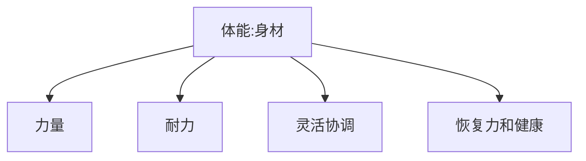

## 阅读前言

本书侧重精力的获取, 防漏和小程度补血, 重复的部分有点多, 可取的地方还是不少的.

![[附件/Excalidraw/Drawing 2022-09-01 04.40.12精力管理手册_训练达到目标.excalidraw]]

## 精力

精力就是一个人一天的决心

![[附件/Excalidraw/Drawing 2022-09-01 04.52.42精力管理手册_精力槽.excalidraw]]

### 涨精力槽

1. 呼吸: 冥想呼吸 运动呼吸
2. 饮食: 喝水与吃饭
	1. 果昔蔬菜昔
	2. 蛋白和肉类蛋白, 坚果
	3. 水: 2000 -2500 毫升
	4. 碳水: 粗粮
3. 睡眠: 大睡与小睡, 节律.
4. 运动: 体型也能影响精力

### 侧漏

1. 拖延
2. 无目标
3. XXX

### 短暂回复 (血瓶)

1. 吃: 坚果, 维 C, 黑巧, 猕猴桃, 百香果, 鲜枣
2. 喝: 纯咖
3. 运动和睡觉
4. 吸薄荷精油, 听歌, 面膜
5. 聊天

## 体能

### 涨体能槽

训练

## 意志

意志力就是长期 focus 的能力

### 涨意志力槽

1. 技巧运动 focus
2. 美术
3. 阅读
4. 写作
5. 仔细听音乐
6. 电影
7. 与人面对面交流

### 意志力 罗伊·鲍迈斯特

1. 意志力的属性
2. 来源
	1. 能量摄入：糖
	2. 吃低血糖食物、累了就睡
3. 目标
	1. GTD，并清晰的列出你要做的事情（具体）
	2. 整理自己的桌子，去除心理焦躁源
4. 决策消耗
5. 量化行为
	1. 将短期行为对比长期目标进行量化
	2. 和有同样目标的人进行比较 
6. 其他方法
	1. 刻意保持一个身姿进行练习，如挺胸抬头等
	2. 冥想

## 训练

1. 目标
2. 计划
3. 反馈

## 目标

1. 自我技能与自我兴趣, 及二者交集
2. 榜样和他的生活状态, 或者伴侣和她的生活状态
3. 成为的路径

## 思考与元经验

先 picture 出自己的偶像并找到成为的路径

1. 精力（一天的决心）：要利用恢复的方法，也要注意练级涨槽
2. 体力：原则可以磨练意志力的方法练习
3. 意志力：利用需要 focus 的活动，有机培养。
